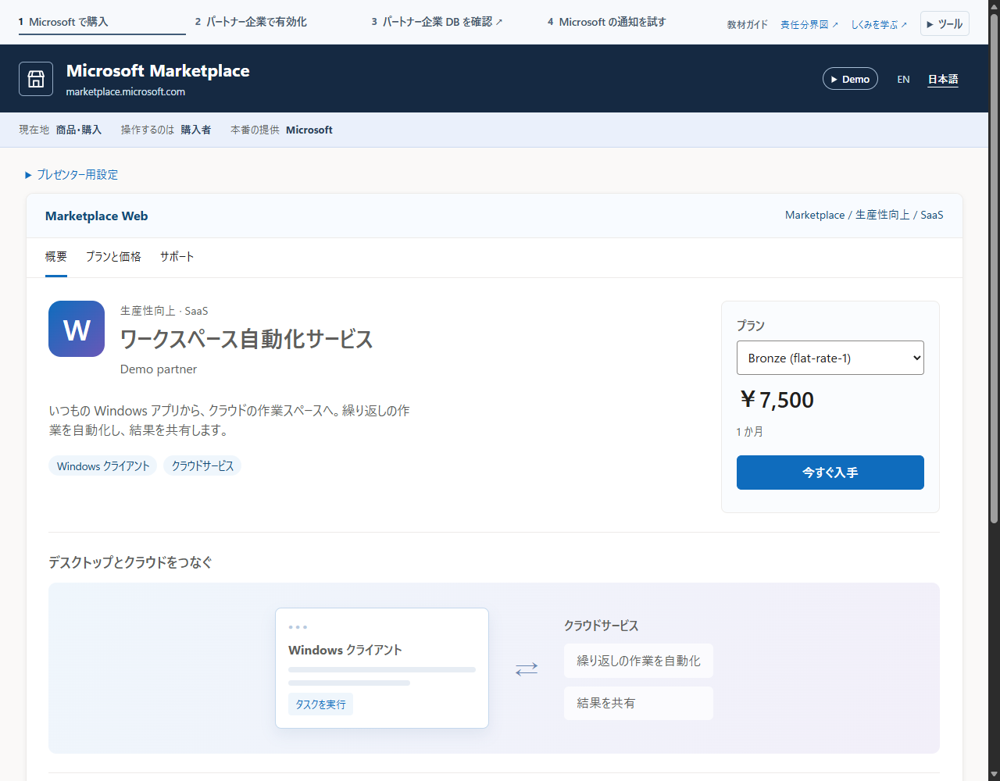
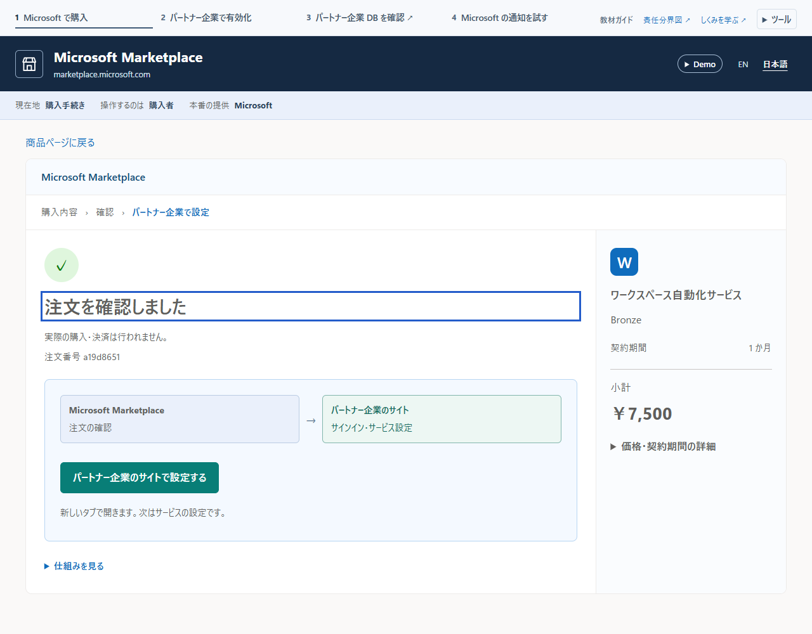
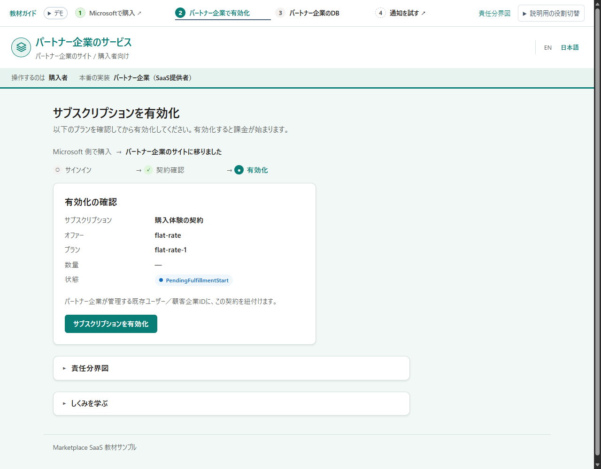
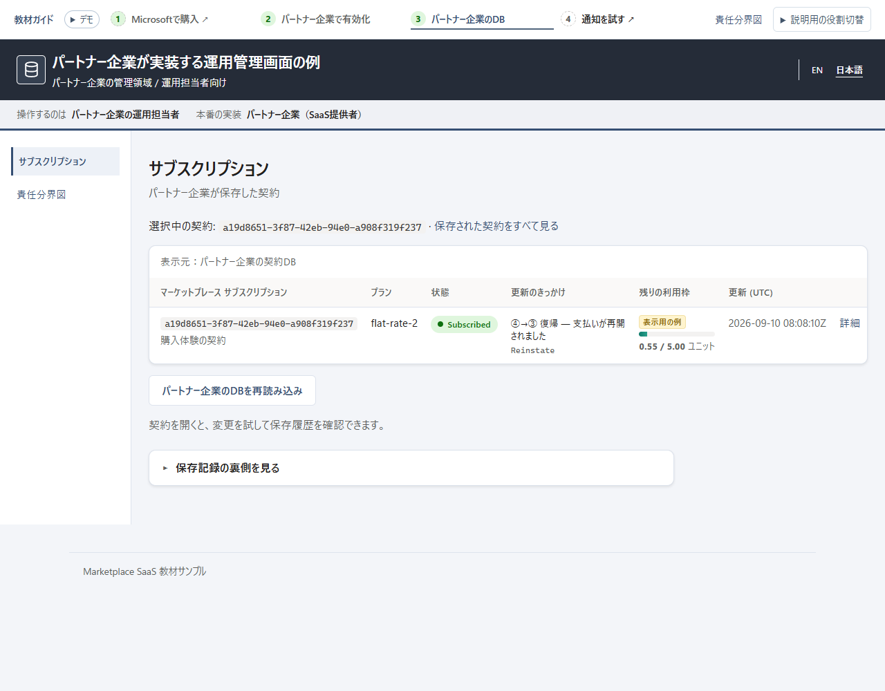
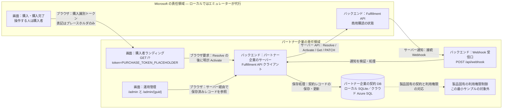

# marketplace-saas-fulfillment-sample

> **実験的な教材サンプル（作成中）。本番利用は想定していません。**
> Microsoft 商用マーケットプレースの **SaaS Offer** を Tier-1 定額（flat-rate）・.NET 10 で
> 公開・運用するための、小さく読みやすいリファレンス実装です。

> 🌐 English README: **[README.md](README.md)**

本サンプルは、マーケットプレース SaaS 購読の **パートナー企業（SaaS パブリッシャー）側** —
Microsoft から商用購読の情報を受け取り、パートナー企業の契約レコードとして保存する
「フルフィルメント層」— を実装します：

- 購入者向けの **SSO ランディングページ**（Resolve → 明示確認のうえ Activate）、
- **接続 Webhook**（サーバー側で検証）、
- **パートナー企業の契約 DB**、
- **最小限のパートナー企業向け運用管理画面**。

本番の購入画面と Fulfillment API は Microsoft が提供し、購入画面は購入者が操作します。
パートナー企業が実装するのは、購入後のランディングページ、サーバーからの API 呼び出し、
Webhook 受信口、契約保存です。**Microsoft の決済画面を実装するわけではありません。**
製品固有の利用権限制御、および **パートナー企業が管理する既存ユーザー／顧客企業ID** との
紐付けもパートナー企業の責任ですが、この最小サンプルには実装されていません。
パートナー企業自身の ID を顧客の ID として扱う意味ではありません。

動かし方は2通りあります：**クラウドのデモ**を1コマンドで Azure にデプロイするか、**手元のマシンだけ**
（Azure 不要）で動かすか。公式の
[SaaS Accelerator](https://github.com/Azure/Commercial-Marketplace-SaaS-Accelerator)（MIT）は
参照実装として利用し（fork しません）、
[Fulfillment API Emulator](https://github.com/microsoft/Commercial-Marketplace-SaaS-API-Emulator)（MIT）が
マーケットプレースの代役を務めるため、実購入は不要です。エミュレーターはコミット
`bb7bc6317128605b2f777ebe1c9969198733ae85` を**リポジトリに同梱したスナップショット**に
教材用 UI の変更を加えたもので、実行時に upstream から取得しません。
[emulator/NOTICE.md](emulator/NOTICE.md) を参照してください。

**marketplace SaaS が初めての方へ:** まず [体験ウォークスルー](docs/walkthrough.ja.md) から。
先に購入を体験し、必要に応じて「誰が何をするか」とその裏側のコードを確認できます。

## 画面イメージ

アプリの `/` は短い説明文1つと **購入体験を始める →** から始まります。
役割や関心の選択は必須ではありません。**有効化の結果で購入者の体験は完結**します。
営業・事業担当や購入者へのデモはここまでで十分で、実装・運用の確認は任意です。
[開始画面](docs/images/screenshots/experience-ja-home.png) と
[有効化の結果](docs/images/screenshots/experience-ja-result.png) を参照してください。

以下は番号付きの手順ではなく、3つの**責任領域**を4つの画面で示します。画像は実際のクライアントUIと
パートナー企業側のアプリを、エミュレーターAPI用の隔離したローカルHTTPフィクスチャで動かしたものです。
合成データを使用し、実購入・実決済はありません。デザイン承認用モック画像ではありません。
クリックすると拡大表示されます。

今回のプレビューでは、対象を絞ったNodeチェック（journey 36件、experience 14件、checkout 18件、
購読選択10件）が通過しています。これはJestスイート全体の実行ではありません。
この環境では、設定済みnpmフィードが必要な依存関係に404を返し、ローカルDockerエンジンも利用できないため、
完全なNodeエミュレーターとJestスイートは未検証です。HTTPフィクスチャを使ったブラウザ確認は、
完全なエミュレーターとの統合検証の代わりではありません。

| | |
| --- | --- |
| **Microsoft の購入領域** — 紺色ヘッダーの模擬ストア。購入者が操作し、本番でパートナー企業が実装する画面ではありません。<br>[](docs/images/screenshots/boundary-ja-purchase.png) | **購入完了からの引き渡し** — **パートナー企業のサイトで設定する** から購入済みランディングへ進みます。全体図は初期状態では閉じた任意の参考情報です。<br>[](docs/images/screenshots/boundary-ja-handoff.png) |
| **パートナー企業のサイト / 購入者向け** — 青緑と白のヘッダーで **ここからパートナー企業が実装** と明示。Resolve の後に明示確認して Activate します。<br>[](docs/images/screenshots/boundary-ja-landing.png) | **パートナー企業の管理領域 / 運用担当者向け** — チャコールのヘッダーとサイドバー。パートナー企業の DB に実際に保存された契約レコードを確認します。<br>[](docs/images/screenshots/boundary-ja-admin.png) |

Microsoft とパートナー企業のヘッダーを区別し、購入者サイトと管理画面を同じ権限のホーム／管理タブとして
並べません。結果の後の **提供元の裏側を見る / See behind the partner site** は任意の説明です。
実際の保存状態と、この契約の `/admin/{guid}` への直接リンクを表示します。役割切替を必須にはしません。

説明の中には **営業・事業、購入者側の組織、実装、運用** という任意の関心項目があります。
購入前の選択ゲートでも模擬ロールでもなく、読みたい説明を選ぶものです。認証・認可・アクセス権付与は
行いません。サーバーAPI・認証・課金・状態遷移・DBスキーマは変更せず、リンクや絞り込み用に
保存済みレコードを読み取るだけです。

管理領域は **パートナー企業が実装する運用管理画面の例** と表示します。
契約の記録・同期はパートナー企業が担当しますが、この管理UIは任意で、既存の管理機能でも構いません。
「誰が実装するか」と「この画面を新規作成することが必須か」は別の話です。

**全体図を見る（View the whole flow）** は `<details id="boundary">` 内で初期状態では閉じています。
同じく初期状態では閉じたアプリの `#how` から **何が起きたか → 誰が実装するか → コード** の順に説明を深掘りできます。
参考の地図は Microsoft での購入、パートナー企業での有効化、契約保存、通知テストをつなぎますが、
購入者に必須の4段階ではありません。購入済みランディングには引き続き購入トークンが必要です。
UI は英語と日本語に対応しています。

各ページ1つの共通の小さな **デモ（Demo）** 表示に、模擬購入で実決済はないことと、**Azure のホスティング費用は発生し得る**
ことをまとめています。注文確認には「実際の注文・決済は行われない」という正確な注意書きを残しています。
有効化の成功は製品の利用権限制御の実装を意味しません。

## 動かし方は2通り

| | **クラウドにデモをデプロイ** | **ローカルで動かす** |
| --- | --- | --- |
| 目的 | 他の人がブラウザでライフサイクルをひと通りクリック体験できる公開 URL | 開発・テスト・お試し |
| コマンド | `azd up` | `dotnet run` / `dotnet test` |
| パートナー企業の契約ストア | **Azure SQL** — マネージド ID でパスワードレス接続 | **SQLite** — セットアップ不要、どのマシンでも動く（arm64 含む） |
| Azure は必要？ | 必要（Azure サブスクリプション） | 不要 |

SQLite は*ローカル開発*用、Azure SQL はクラウド用のパートナー企業の契約ストアです。
UI はこの保存済みレコードを読み取り、エミュレーターの別の購読テーブルは読みません。
どちらの DB も Microsoft が管理する商用状態や課金の正本に置き換わるものではありません。
同じアプリが設定によって両方の DB プロバイダに対応します。

### クラウドにデモをデプロイ（azd）

1コマンドで Azure をプロビジョニングし、3つ — **アプリ**・その **Azure SQL** 状態ストア・
**Fulfillment API Emulator**（模擬マーケットプレース。Azure Container Apps 上）
— をデプロイします。できあがるのは、購読ライフサイクルをまるごとブラウザでクリック体験できる公開 URL
です（ローカル準備も実購入も不要）。これは手順を1つずつ追う [docs/deploy.ja.md](docs/deploy.ja.md) の
自動版です。azd が初めてなら
[Azure Developer CLI のドキュメント](https://learn.microsoft.com/ja-jp/azure/developer/azure-developer-cli/overview)を参照。

```bash
# 事前準備（初回のみ）: Azure Developer CLI（https://aka.ms/azd-install）・
# Azure CLI・sqlcmd を入れてサインイン:
azd auth login

azd up      # 環境名・サブスクリプション・リージョンを選ぶ
            # → App Service ＋ Azure SQL ＋ エミュレーター（Container Apps）を作成
            # → 一式をデプロイ（数分）し、アプリとエミュレーターの URL を表示

azd down    # 使い終わったら一括削除
```

購入者サインインは既定で**オフ**なので、設定は不要です。`azd up` は各サービスの **Endpoint** URL
（**エミュレーター**と**アプリ**）を表示します（`azd show` で再表示可）。まず **アプリの `/`** にある
開始画面を開き、**購入体験を始める →** を選びます：

1. エミュレーターの **`/start.html`** 製品ページから **`/checkout.html`** へ進みます。
   `web-card`・`web-azure`・`azure-portal` は購入経路を示す説明用シナリオで、実決済はありません。
2. 模擬購入完了で **パートナー企業のサイトで設定する** を選びます。ブラウザがパートナー企業の
   `GET /?token=<purchase-token>`（表記はプレースホルダ）を開きます。
3. パートナー企業のサーバーが **Resolve** を呼び、購入者が内容を確認して **Activate** を明示実行します。
   結果が表示されたら購入者の体験は完了で、管理画面に進む必要はありません。
4. **任意：** **提供元の裏側を見る** で保存状態を確認し、同じ保存済み契約の `/admin/{guid}` に直接進みます。
   `/admin?marketplaceSubscriptionId=<actual-id>` の一覧リンクは保存済みの Marketplace ID と完全一致で
   絞り込み、一致しなければ空の結果を示します。別の契約や架空の詳細リンクで代用しません。
5. **任意：** 詳細画面の **この契約の変更を試す（Try a change for this contract）** から、
   エミュレーターの `/subscriptions.html?subscriptionId=<actual-marketplace-id>` へ進みます。
   同じ契約を選択した状態で **Suspend**・**Reinstate**・**Change plan**・**Unsubscribe** の通知を試せます。
   **Show all** はデモの文脈を保ったままエミュレーターの選択を明示的に解除します。
   パートナー企業の保存記録へのリンクは、設定済みの接続先オリジンとこの Marketplace ID から作られます。
6. **任意のテスト後：** 同じ契約の詳細に戻り、**`#history`** を再読み込みして、保存されたイベントと記録に基づくプラン比較を確認します。
   以前のプランが不明なら **記録なし（Not recorded）** と表示し、現在のプランから推測しません。
   配信と保存は非同期のため、画面だけで同期済みとは断定できません。

上記のID表記は説明用のプレースホルダです。UIの保存済みレコードへのリンクを使ってください。
パートナー企業側のレコードGUIDと Marketplace の購読IDは、用途が異なります。

エミュレーターの旧 `/` トークンフォームと `/landing.html` API テストページは技術検証用ツールとして
残ります。Microsoft が提供するランディングページでもパートナー企業の製品 UI でもありません。
購入体験の入口は `/start.html` であり、旧トップページの **Continue** ではありません。

**実際の**マーケットプレースを相手にした本番寄りの構成（サインイン有効・エミュレーターなし・各手順の
解説つき）は [docs/deploy.ja.md](docs/deploy.ja.md) を参照してください。

> **表示言語:** アプリの UI は **英語と日本語**に対応しています。既定ではブラウザの言語に従い、
> ヘッダーの **EN / 日本語** トグルでいつでも切り替えられます。

### ローカルで動かす

**自動の合成 L2 テスト**に必要なのは
[.NET 10 SDK](https://dotnet.microsoft.com/download/dotnet/10.0) だけです。
Docker・Azure・実購入は不要です。アプリとリポジトリ内の HTTP フィクスチャを起動するテストであり、
**ブラウザ用の完全なエミュレーターを起動するものではありません**。

```bash
git clone https://github.com/MamoruKuroda/marketplace-saas-fulfillment-sample
cd marketplace-saas-fulfillment-sample

# 自動 HTTP フィクスチャ: Resolve → Activate → Webhook → パートナー企業のレコード。
# Docker 不要。ブラウザ用の完全なエミュレーターは起動しません。
dotnet test --filter FullyQualifiedName~SyntheticL2LifecycleTests

# パートナー企業のアプリだけを起動し、開始画面を開く:
dotnet run --project src/SaaSAgentSample.Web
#   → http://localhost:5134/
```

開発時は SQLite を使い、購入者サインインは無効、Fulfillment クライアントはエミュレーター向けの
設定です。ただし **`dotnet run` だけではエミュレーターは起動しません**。ブラウザで購入から有効化まで
操作するには、同梱の Node エミュレーターを別途起動します。Node/npm の依存関係をインストール・
ビルドして動かすか、Docker を使う必要があります。開発時の既定ポートと Docker の公開ポートは異なるため、
アプリの Fulfillment ベース URL、エミュレーターのランディング URL、Webhook URL を合わせてください。

設定は [docs/develop.ja.md](docs/develop.ja.md) と [docs/l2-demo.ja.md](docs/l2-demo.ja.md) の
手動エミュレーター手順を参照してください。両方を起動したら、**アプリ `/` → 購入体験を始める →
エミュレーター `/start.html` → `/checkout.html` → パートナー企業のサイトで設定する → ランディング →
明示 Activate → 結果** の順に進みます。ここで終えても、任意で同じ契約の保存状態・変更テストへ進んでも構いません。
L2 リファレンスのトークンフォームを使う手順はAPI検証用であり、購入者向けストア体験とは別です。

<details>
<summary>用語（v0・L2・Tier-1 など）</summary>

| 用語 | 意味 |
| --- | --- |
| **Tier-1 定額（flat-rate）** | Microsoft の価格モデルの1つ。購読ごとに月額固定価格を1つ設定（従量課金・ユーザー数課金なし）。 |
| **フルフィルメント層** | パートナー企業側の実装：ランディングページ・サーバーからの API 呼び出し・接続 Webhook・契約ストア。 |
| **v0** | 本サンプルの最初のバージョン — すべてローカルで動作。 |
| **L2** | 統合レベルのエンドツーエンド実証：アプリが実 HTTP 上でフルフィルメント API（エミュレーター）と通信し、全購読ライフサイクルを駆動。 |
| **合成 L2（Synthetic L2）** | 自動化 in-repo バリアント — Docker エミュレーターを HTTP スタブで置換（Docker 不要）。 |

</details>

## アーキテクチャ

図では **人が開く画面**、**サーバー処理／受信口**、**保存先** を区別します。本番の購入画面と
Fulfillment API の商用状態は Microsoft、購入後の実装はパートナー企業が担当します。
ローカルのデモでは同梱エミュレーターが Microsoft の代役となり、実課金はありません。
`azd` で**クラウドのデモ**として
デプロイすると、同じ部品が Azure 上で動きます — アプリは App Service、状態ストアは Azure SQL、
エミュレーターは Azure Container Apps — つまりクリックできる一連のフローが何もインストールせずに動きます。
（本番寄りの [docs/deploy.ja.md](docs/deploy.ja.md) は、エミュレーターではなく*実際の*マーケットプレースを対象にします。）



矢印は責任と通信種別を示し、即時同期を保証するものではありません。管理 UI はパートナー企業の
レコードだけを参照します。エミュレーターのテーブルは別であり、模擬購読レコードが作られるのは
**Resolve 時**です。購入画面で実際に課金して作られるわけではありません。

## ソリューション構成

| プロジェクト | 役割 |
| --- | --- |
| `src/SaaSAgentSample.Core` | ドメインモデル（購読・状態・プラン）。インフラ非依存 |
| `src/SaaSAgentSample.Data` | EF Core のパートナー企業の契約ストア。SQLite / SQL Server / Azure SQL |
| `src/SaaSAgentSample.Fulfillment` | Fulfillment/Operations API v2 クライアント＋サーバー側 Webhook 検証 |
| `src/SaaSAgentSample.Web` | パートナー企業の購入者ランディング・接続 Webhook・運用管理画面 |
| `tests/SaaSAgentSample.Tests` | ユニット＋統合（合成エンドツーエンド）テスト |
| `emulator/` | 同梱 Microsoft API エミュレータースナップショットと教材画面。NOTICE を参照 |
| `infra/`・`azure.yaml`・`scripts/` | 承認前提の `azd` クラウドデプロイ：App Service ＋ Azure SQL ＋ 同梱エミュレーター（Container Apps）の Bicep とデプロイフック |

## ローカルで開発・テストする

上の [ローカルで動かす](#ローカルで動かす) は HTTP フィクスチャと手動のブラウザ体験を区別しています。データベース
プロバイダ（SQLite / SQL Server / Azure SQL）・マイグレーション・アプリ起動・設定・SQL Server 統合
テストなど、ローカル開発のすべては **[docs/develop.ja.md](docs/develop.ja.md)** を参照してください。

**エンドツーエンドで実証（L2）:** フルフィルメントの一連（Resolve → Activate → Webhook → 状態）を
実購入なしで通しで実行します。自動テストが実 HTTP 上で駆動し、Docker は不要です：

```bash
dotnet test --filter FullyQualifiedName~SyntheticL2LifecycleTests
```

手動のエミュレーター手順を含む詳細は [docs/l2-demo.ja.md](docs/l2-demo.ja.md)。

## ガードレール

本サンプルが決して破らないルール：

- パートナー企業の UI は保存済みレコードを表示し、商用購読の情報は Microsoft の Fulfillment API から取得します。
  根拠なしに両ストアが同期済みであるとは断定しません。
- `ChangeQuantity` は記録・応答しますが、パートナー企業のドメインに数量項目はありません。
  製品固有の利用権限制御と実アカウント紐付けは最小サンプルの対象外です。
- 任意の関心項目や裏側を見るリンクは説明であり、模擬ロールやアクセス権付与ではありません。
- 購入者／管理画面からの有効化には明示的な確認が必須です。
- 購入/ベアラートークン・シークレット・不要な PII をログに入れません。
- Webhook はサーバー側で検証します（Get Operation と、署名検証有効時の Entra JWT）。
  ローカルのデモ用に署名検証を緩和する設定は、本番用の認証ではありません。

## デプロイ

対象は Azure App Service（.NET 10）＋ Azure SQL で、アプリはマネージド ID による**パスワードレス**接続で
データベースに接続します（接続文字列にシークレットなし）。プロビジョニングは人間の承認がある場合のみで、
ここから自動でデプロイされることはありません。

- **1コマンド:** `azd up` — 上の [クラウドにデモをデプロイ](#クラウドにデモをデプロイazd) を参照。
  `infra/` に定義した内容一式をプロビジョニングし、アプリ**とエミュレーター**をデプロイします（そのままクリック体験できるデモ）。
- **1ステップずつ:** [docs/deploy.ja.md](docs/deploy.ja.md) が各 `az` コマンド（プロビジョニング・
  マネージド ID による SQL アクセス・アプリ設定・デプロイ・オファーのランディングページと接続 Webhook の
  配線）を1つずつ解説します。各リソースを理解したいときや本番寄りの構成に。

## 参考リンク

既存の参考 URL を残しています。**今回の文書改訂では再検証していません（未検証）**。
ローカルの教材 UI は説明用であり、本番のすべての購入経路を保証するものではありません。

- SaaS fulfillment APIs: <https://learn.microsoft.com/en-us/partner-center/marketplace-offers/pc-saas-fulfillment-apis>
- SaaS subscription life cycle: <https://learn.microsoft.com/en-us/partner-center/marketplace-offers/pc-saas-fulfillment-life-cycle>
- Implementing a webhook (JWT validation + Get Operation): <https://learn.microsoft.com/en-us/partner-center/marketplace-offers/pc-saas-fulfillment-webhook>
- Register a SaaS application: <https://learn.microsoft.com/en-us/partner-center/marketplace-offers/pc-saas-registration>
- Deploy an ASP.NET web app to App Service: <https://learn.microsoft.com/en-us/azure/app-service/quickstart-dotnetcore>
- Azure Developer CLI (azd): <https://learn.microsoft.com/ja-jp/azure/developer/azure-developer-cli/overview>
- Connect .NET apps to Azure SQL with managed identity: <https://learn.microsoft.com/en-us/azure/app-service/tutorial-connect-msi-sql-database>
- What is Azure SQL Database: <https://learn.microsoft.com/en-us/azure/azure-sql/database/sql-database-paas-overview?view=azuresql>
- .NET lifecycle (.NET 10 supported to 2028-11-14): <https://learn.microsoft.com/en-us/lifecycle/products/microsoft-net-and-net-core>

## ライセンス

[MIT](LICENSE).
