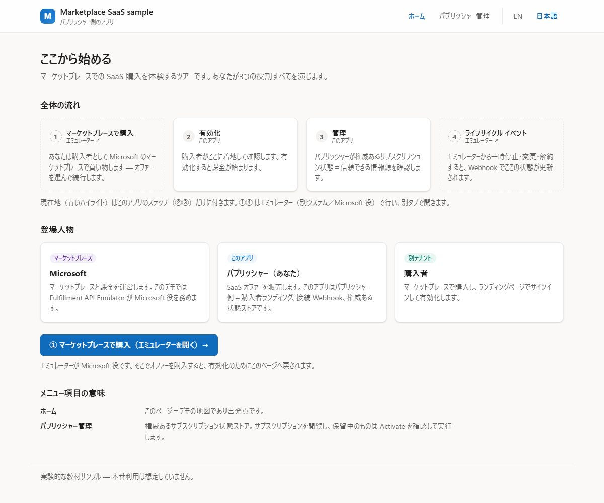
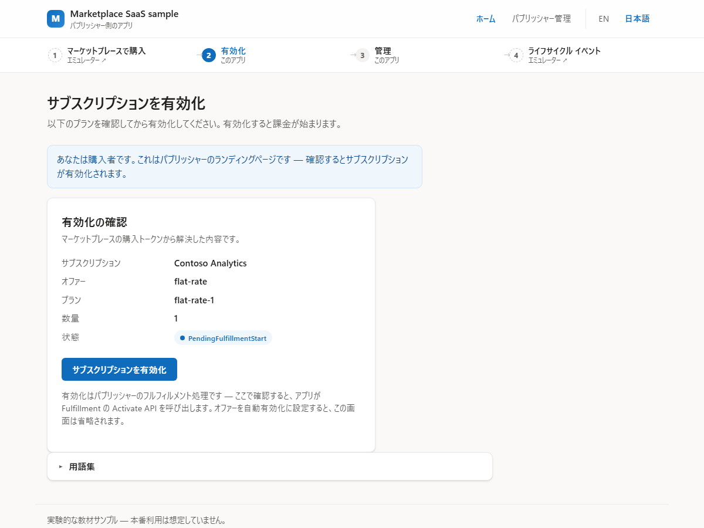
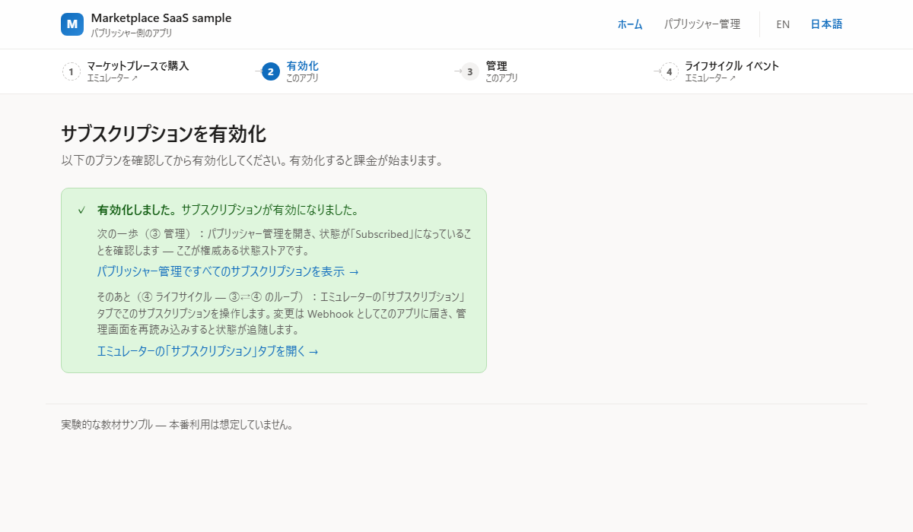
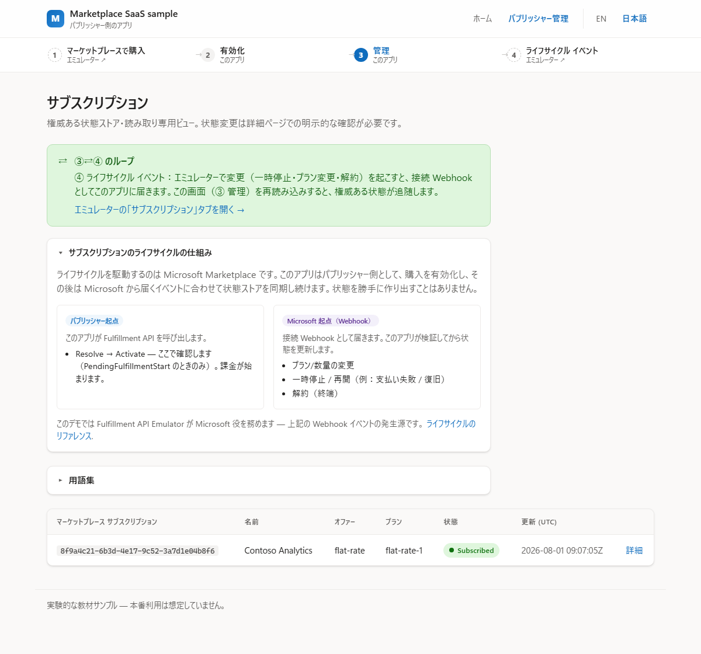

# marketplace-saas-agent-sample

> **実験的な教材サンプル（作成中）。本番利用は想定していません。**
> Microsoft 商用マーケットプレースの **SaaS Offer** を Tier-1 定額（flat-rate）・.NET 10 で
> 公開・運用するための、小さく読みやすいリファレンス実装です。

> 🌐 English README: **[README.md](README.md)**

本サンプルは、マーケットプレース SaaS 購読の *パブリッシャー側* — 購読の状態を Microsoft と
同期させ続ける「フルフィルメント層」— を実装します：

- 購入者向けの **SSO ランディングページ**（Resolve → 明示確認のうえ Activate）、
- **接続 Webhook**（サーバー側で検証）、
- **権威ある購読状態ストア**、
- **最小限のパブリッシャー管理画面**。

動かし方は2通りあります：**クラウドのデモ**を1コマンドで Azure にデプロイするか、**手元のマシンだけ**
（Azure 不要）で動かすか。公式の
[SaaS Accelerator](https://github.com/Azure/Commercial-Marketplace-SaaS-Accelerator)（MIT）は
参照実装として利用し（fork しません）、
[Fulfillment API Emulator](https://github.com/microsoft/Commercial-Marketplace-SaaS-API-Emulator)（MIT）が
マーケットプレースの代役を務めるため、実購入は不要です。

**marketplace SaaS が初めての方へ:** まず [体験ウォークスルー](docs/walkthrough.ja.md) から。
購入者・パブリッシャーそれぞれの「誰が何をするか」を平易に地図化し、本サンプルの実装に対応づけています。

## 画面イメージ

2つのシステムにまたがる4ステップを、あなたが3役すべてを演じながら体験します。画像をクリックすると拡大表示されます。

| | |
| --- | --- |
| **① ここから始める** — アプリが入口です。3つの役割と全体の流れを示し、ステップ①をエミュレーターで開くボタンを置いています。<br>[](docs/images/screenshots/ja-1-home.png) | **② 有効化** — あなたは購入者です。ランディングページが購入トークンを Resolve し、有効化の前に明示的な確認を求めます。<br>[](docs/images/screenshots/ja-2-landing.png) |
| **③ 有効化完了** — 有効化すると Fulfillment の Activate API が呼ばれ、次の一歩と ③⇄④ のループが案内されます。<br>[](docs/images/screenshots/ja-3-activated.png) | **④ パブリッシャー管理** — 権威ある状態ストアです。状態が `Subscribed` になり、ライフサイクルの解説が添えられています。<br>[](docs/images/screenshots/ja-4-admin.png) |

①と④は Fulfillment API Emulator（Microsoft の代役）で、②と③がこのアプリです。UI は英語と日本語に対応しています。

## 動かし方は2通り

| | **クラウドにデモをデプロイ** | **ローカルで動かす** |
| --- | --- | --- |
| 目的 | 他の人がブラウザでライフサイクルをひと通りクリック体験できる公開 URL | 開発・テスト・お試し |
| コマンド | `azd up` | `dotnet run` / `dotnet test` |
| 状態ストア | **Azure SQL** — 権威あるストア。マネージド ID でパスワードレス接続 | **SQLite** — セットアップ不要、どのマシンでも動く（arm64 含む） |
| Azure は必要？ | 必要（Azure サブスクリプション） | 不要 |

SQLite は*ローカル開発*用のストア（何もインストール不要でどこでも動く）、Azure SQL はクラウドで使う
*権威ある*ストアです。アプリもコードも同じ — 違うのは `Database:Provider` だけ。

### クラウドにデモをデプロイ（azd）

1コマンドで Azure をプロビジョニングし、3つ — **アプリ**・その **Azure SQL** 状態ストア・
**Fulfillment API Emulator**（Microsoft のトークン不要なマーケットプレース代役。Azure Container Apps 上）
— をデプロイします。できあがるのは、購読ライフサイクルをまるごとブラウザでクリック体験できる公開 URL
です（ローカル準備も実購入も不要）。これは手順を1つずつ追う [docs/deploy.ja.md](docs/deploy.ja.md) の
自動版です。azd が初めてなら
[Azure Developer CLI のドキュメント](https://learn.microsoft.com/ja-jp/azure/developer/azure-developer-cli/overview)を参照。

```bash
# 事前準備（初回のみ）: Azure Developer CLI（https://aka.ms/azd-install）・
# Azure CLI・sqlcmd を入れてサインイン:
azd auth login

azd up      # 環境名・サブスクリプション・リージョンを選ぶ
            # → App Service ＋ Azure SQL ＋ エミュレーター（Container Apps）を作成
            # → 一式をデプロイ（数分）し、アプリとエミュレーターの URL を表示

azd down    # 使い終わったら一括削除
```

購入者サインインは既定で**オフ**なので、設定は不要です。`azd up` は各サービスの **Endpoint** URL
（**エミュレーター**と**アプリ**）を表示します（`azd show` で再表示可）。エミュレーターの URL を開いて、
あとはブラウザからライフサイクル全体を駆動します：

1. **エミュレーター**（トップページが Marketplace 購入ページ）でプランを選び **Continue** をクリック。
   エミュレーターがアプリに購入トークンを渡し、アプリのランディングページを自動で開きます。
2. アプリの**ランディングページ**で、解決された購読内容を確認し **Activate** をクリック — 状態が
   **Subscribed** に。ページ内の **Publisher admin** リンクをたどると保存された状態を確認できます。
3. エミュレーターに戻り、上部ナビの **Subscriptions** タブをクリックして、対象の購読に対しイベントを
   駆動 — **Suspend**・**Reinstate**・**Change plan**・**Unsubscribe**（各操作がアプリへ接続 Webhook を発火）。
4. アプリの **Publisher admin** を再読み込みし、権威ある状態が各イベントに追随する様子を確認
   （エミュレーターの通知遅延のため数秒待つ）。

> `azd up` は完了時に、この手順（あなたの2つの URL つき）をターミナルに表示します — まず
> **エミュレーター** の URL を開いてください。アプリ自身の URL は購入者が着地する場所です。

**実際の**マーケットプレースを相手にした本番寄りの構成（サインイン有効・エミュレーターなし・各手順の
解説つき）は [docs/deploy.ja.md](docs/deploy.ja.md) を参照してください。

> **表示言語:** アプリの UI は **英語と日本語**に対応しています。既定ではブラウザの言語に従い、
> ヘッダーの **EN / 日本語** トグルでいつでも切り替えられます。

### ローカルで動かす

必要なのは [.NET 10 SDK](https://dotnet.microsoft.com/download/dotnet/10.0) だけです。
Docker・Azure・マーケットプレースでの購入は不要です。

```bash
git clone https://github.com/MamoruKuroda/marketplace-saas-agent-sample
cd marketplace-saas-agent-sample

# 購読ライフサイクル全体（Resolve → Activate → Webhook → 状態）を
# ローカル HTTP 上でエンドツーエンドに実証:
dotnet test --filter FullyQualifiedName~SyntheticL2LifecycleTests

# …または、アプリを起動してパブリッシャー管理画面を開く:
dotnet run --project src/SaaSAgentSample.Web
#   → http://localhost:5134/admin
```

開発時はローカルの SQLite ストアを使い、サインインは無効、Fulfillment クライアントは
エミュレーター向けに設定されます — つまり他に何もインストールせずに一連のフローが動きます。
ローカル開発の詳細（プロバイダ・マイグレーション・設定・SQL Server テスト）は
[docs/develop.ja.md](docs/develop.ja.md) を参照。

<details>
<summary>用語（v0・L2・Tier-1 など）</summary>

| 用語 | 意味 |
| --- | --- |
| **Tier-1 定額（flat-rate）** | Microsoft の価格モデルの1つ。購読ごとに月額固定価格を1つ設定（従量課金・ユーザー数課金なし）。 |
| **フルフィルメント層** | パブリッシャー側の実装：ランディングページ・接続 Webhook・購読状態ストア。 |
| **v0** | 本サンプルの最初のバージョン — すべてローカルで動作。 |
| **L2** | 統合レベルのエンドツーエンド実証：アプリが実 HTTP 上でフルフィルメント API（エミュレーター）と通信し、全購読ライフサイクルを駆動。 |
| **合成 L2（Synthetic L2）** | 自動化 in-repo バリアント — Docker エミュレーターを HTTP スタブで置換（Docker 不要）。 |

</details>

## アーキテクチャ

**ローカル**で動かすときは、すべてが 1 台のマシン上で動作します（下図）。`azd` で**クラウドのデモ**として
デプロイすると、同じ部品が Azure 上で動きます — アプリは App Service、状態ストアは Azure SQL、
エミュレーターは Azure Container Apps — つまりクリックできる一連のフローが何もインストールせずに動きます。
（本番寄りの [docs/deploy.ja.md](docs/deploy.ja.md) は、エミュレーターではなく*実際の*マーケットプレースを対象にします。）

<!-- GitHub の Mermaid は日本語ラベルを見切れさせるため、PNG を事前生成して埋め込み。ソース: docs/images/ja-architecture.mmd -->


## ソリューション構成

| プロジェクト | 役割 |
| --- | --- |
| `src/SaaSAgentSample.Core` | ドメインモデル（購読・状態・プラン）。インフラ非依存 |
| `src/SaaSAgentSample.Data` | EF Core の状態ストア（唯一の正本）。SQL Server / Azure SQL |
| `src/SaaSAgentSample.Fulfillment` | Fulfillment/Operations API v2 クライアント＋サーバー側 Webhook 検証 |
| `src/SaaSAgentSample.Web` | 購入者 SSO ランディング・接続 Webhook・パブリッシャー管理 |
| `tests/SaaSAgentSample.Tests` | ユニット＋統合（合成エンドツーエンド）テスト |
| `infra/`・`azure.yaml`・`scripts/` | `azd` クラウドデプロイ：App Service ＋ Azure SQL ＋ エミュレーター（Container Apps）の Bicep と、取得/デプロイ後フック |

## ローカルで開発・テストする

上の [ローカルで動かす](#ローカルで動かす) クイックスタートだけで動作を確認できます。データベース
プロバイダ（SQLite / SQL Server / Azure SQL）・マイグレーション・アプリ起動・設定・SQL Server 統合
テストなど、ローカル開発のすべては **[docs/develop.ja.md](docs/develop.ja.md)** を参照してください。

**エンドツーエンドで実証（L2）:** フルフィルメントの一連（Resolve → Activate → Webhook → 状態）を
実購入なしで通しで実行します。自動テストが実 HTTP 上で駆動し、Docker は不要です：

```bash
dotnet test --filter FullyQualifiedName~SyntheticL2LifecycleTests
```

手動のエミュレーター手順を含む詳細は [docs/l2-demo.ja.md](docs/l2-demo.ja.md)。

## エージェント層 — 計画中（v0 では未実装）

このリポジトリが `marketplace-saas-agent-sample` と名付けられているのは、その**設計上の意図**を反映しているためです：LLM ツール呼び出し層（[Microsoft Foundry Agent Service](https://learn.microsoft.com/ja-jp/azure/foundry/agents/overview) への昇格も視野に入れた）をフルフィルメント層と並ぶコア要素とする設計です。マーケットプレースのフルフィルメント操作（Resolve・Activate・Get Subscription・Webhook 操作）は型付きのツール呼び出しに自然にマッピングでき、会話型エージェントが購読ライフサイクルをエンドツーエンドで駆動できます。

**v0（このバージョン）はフルフィルメント層のみ**を実装します：この README に記載されているランディングページ・Webhook・状態ストア・パブリッシャー管理画面がそれです。エージェント / LLM 層はまだ実装されていません。

エージェント層が実装される際には、フルフィルメント操作をツールとして公開し、会話型エージェントがライフサイクルをエンドツーエンドで駆動できるようにします — 状態を変更するすべての呼び出しにおいて、状態 DB が唯一の正本であり続けます。

## ガードレール

本サンプルが決して破らないルール：

- 状態 DB が唯一の正本。購読状態はストアと Fulfillment API のみに由来し、アプリが捏造することはありません。
- 状態を変更する操作には明示的な確認が必須です。
- 購入/ベアラートークン・シークレット・不要な PII をログに入れません。
- Webhook の Authorization 検証はサーバー側（Entra JWT ＋ Get Operation）で行います。

## デプロイ

対象は Azure App Service（.NET 10）＋ Azure SQL で、アプリはマネージド ID による**パスワードレス**接続で
データベースに接続します（接続文字列にシークレットなし）。プロビジョニングは人間の承認がある場合のみで、
ここから自動でデプロイされることはありません。

- **1コマンド:** `azd up` — 上の [クラウドにデモをデプロイ](#クラウドにデモをデプロイazd) を参照。
  `infra/` に定義した内容一式をプロビジョニングし、アプリ**とエミュレーター**をデプロイします（そのままクリック体験できるデモ）。
- **1ステップずつ:** [docs/deploy.ja.md](docs/deploy.ja.md) が各 `az` コマンド（プロビジョニング・
  マネージド ID による SQL アクセス・アプリ設定・デプロイ・オファーのランディングページと接続 Webhook の
  配線）を1つずつ解説します。各リソースを理解したいときや本番寄りの構成に。

## 参考リンク

- SaaS fulfillment APIs: <https://learn.microsoft.com/en-us/partner-center/marketplace-offers/pc-saas-fulfillment-apis>
- SaaS subscription life cycle: <https://learn.microsoft.com/en-us/partner-center/marketplace-offers/pc-saas-fulfillment-life-cycle>
- Implementing a webhook (JWT validation + Get Operation): <https://learn.microsoft.com/en-us/partner-center/marketplace-offers/pc-saas-fulfillment-webhook>
- Register a SaaS application: <https://learn.microsoft.com/en-us/partner-center/marketplace-offers/pc-saas-registration>
- Deploy an ASP.NET web app to App Service: <https://learn.microsoft.com/en-us/azure/app-service/quickstart-dotnetcore>
- Azure Developer CLI (azd): <https://learn.microsoft.com/ja-jp/azure/developer/azure-developer-cli/overview>
- Connect .NET apps to Azure SQL with managed identity: <https://learn.microsoft.com/en-us/azure/app-service/tutorial-connect-msi-sql-database>
- What is Azure SQL Database: <https://learn.microsoft.com/en-us/azure/azure-sql/database/sql-database-paas-overview?view=azuresql>
- .NET lifecycle (.NET 10 supported to 2028-11-14): <https://learn.microsoft.com/en-us/lifecycle/products/microsoft-net-and-net-core>

## ライセンス

[MIT](LICENSE).
