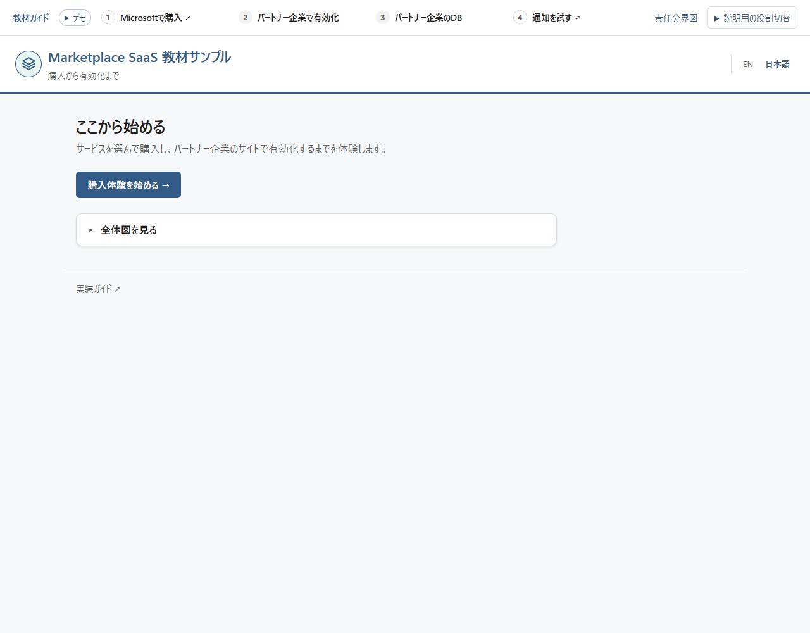
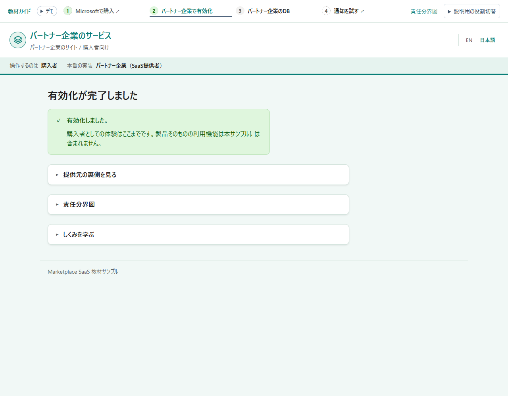

# marketplace-saas-fulfillment-sample

**Marketplaceで購入したSaaSが、パートナー企業のサービスにつながるまでを体験できます。**
模擬購入からパートナー企業のサイトへの引き渡し、有効化までを操作し、必要に応じて
その裏側の契約保存や通知も確認するサンプルです。

> 実験的な学習用サンプルで、本番利用できる完成品ではありません。実購入・実決済はありません。
> Azureにデモを配置する場合はホスティング費用が発生し得ます。
> 製品の利用権制御と実顧客アカウントへの紐付けは未実装です。
>
> English: **[README.md](README.md)**

## デモを試す

**管理者からデモURLを受け取った方：** パートナー企業側アプリの `/` を開き、
**購入体験を始める →** を選びます。有効化の結果で購入者の体験は完結し、
管理画面を開くことは任意です。先にガイドを読む必要はありません。

**自分の環境を用意する方：** [デモの準備手順](docs/run-demo.ja.md)へ進んでください。
ローカルとAzureのどちらも、標準のデモ構成は実Marketplaceではなくエミュレーターを使います。
このリポジトリは常時利用できる共有デモを保証していません。管理者提供のURLか、
自分で準備した環境を使います。

動かさずに画面を確認することもできます。

| 購入体験の開始 | 有効化の結果 |
| --- | --- |
|  |  |

画像は合成データを使ったサンプルの画面で、実購入ではありません。
[撮影条件](docs/develop.ja.md#screenshots-and-evidence)は、完全なエミュレーターでの動作確認とは区別しています。

## パートナー企業は何を作るのか

| 区分 | 内容 |
| --- | --- |
| パートナー企業が作るものではない | 本番のMicrosoft側の購入画面。`emulator`内の画面はその模擬部分です。 |
| このサンプルで学べる | 購入後のランディング、サーバーからのFulfillment API呼び出し、通知処理、契約保存。 |
| 製品に合わせて追加する | **パートナー企業が管理する既存ユーザー／顧客企業ID**への契約の紐付け、製品の利用制御、サービス固有の運用。サンプルだけでは完成しません。 |

購入・有効化の画面を操作するのは購入者です。パートナー企業の運用担当者は保存記録を確認できますが、
この管理画面は実装例であり、同じ画面を新規作成することが必須ではありません。
Microsoftの商用状態、パートナー企業の保存記録、製品へのアクセスは別のものです。
**有効化の成功は、製品への組み込みの完成を意味しません。**

## 体験の意味を知る・実装を検討する

| 知りたいこと | 開く文書 |
| --- | --- |
| デモ環境の用意 | [デモの準備](docs/run-demo.ja.md) |
| 何が起きたか、誰が実装するか、どこにコードがあるか | [デモの実装ガイド](docs/walkthrough.ja.md) |
| 実装済みの部分と、サービスに追加する部分 | [実装範囲の対応表](docs/walkthrough.ja.md#implementation-boundary) |
| ビルド、設定、コードの変更 | [ローカル開発](docs/develop.ja.md) |
| 保存結果と通知の確認 | [連携の検証](docs/l2-demo.ja.md) |
| 実オファーとの接続前に確認すること | [実Marketplace接続の参考](docs/deploy.ja.md) — 追加実装が必要 |

デモの各画面にある **実装ガイド ↗** は、表示言語に対応するリポジトリ文書を開きます。
購入トークンや契約のクエリ情報は送信しません。操作の主役はデモのままで、
文書は必要なときの説明であり、購入の必須手順ではありません。

## ソリューション構成

パートナー企業側アプリは.NET 10とRazor Pagesで実装しています。既存のプロジェクト名は維持しています。

| 場所 | 役割 |
| --- | --- |
| `src/SaaSAgentSample.Web` | 購入者ランディング、Webhook受信口、運用管理画面の例 |
| `src/SaaSAgentSample.Fulfillment` | Fulfillment APIクライアントとWebhookトークン検証 |
| `src/SaaSAgentSample.Core` / `Data` | 契約モデルと保存（SQLite / SQL Server） |
| `tests` | 自動テスト。[確認範囲](docs/l2-demo.ja.md#automated-checks)を参照 |
| `emulator` | 同梱APIエミュレーターと購入シミュレーション |
| `infra`、`azure.yaml`、`scripts` | Azureデモのリソースとデプロイフック |
| `docs` | 体験の説明、準備、開発、検証 |

ビルド・テストは[develop](docs/develop.ja.md)、ブラウザー用デモ一式の準備は
[run-demo](docs/run-demo.ja.md)にまとめています。アプリ単独の起動や自動テストは、
ストア全体の起動ではありません。

## 出自とライセンス

MITの[SaaS Accelerator](https://github.com/Azure/Commercial-Marketplace-SaaS-Accelerator)は
参考実装であり、このリポジトリはそのforkではありません。
[Microsoft Fulfillment API Emulator](https://github.com/microsoft/Commercial-Marketplace-SaaS-API-Emulator)は
`bb7bc6317128605b2f777ebe1c9969198733ae85`を同梱し、教材用UIの変更を加えています。
実行時にupstreamから取得するものではありません。[emulator/NOTICE.md](emulator/NOTICE.md)を参照してください。
Marketplaceの公式参考資料は[実装ガイド](docs/walkthrough.ja.md#sources)にまとめています。

## ライセンス

[MIT](LICENSE)。エミュレーターは独自の[MITライセンス](emulator/LICENSE)を保持しています。
