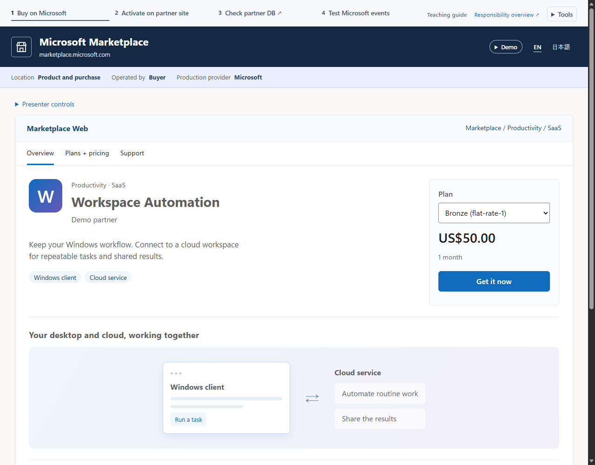
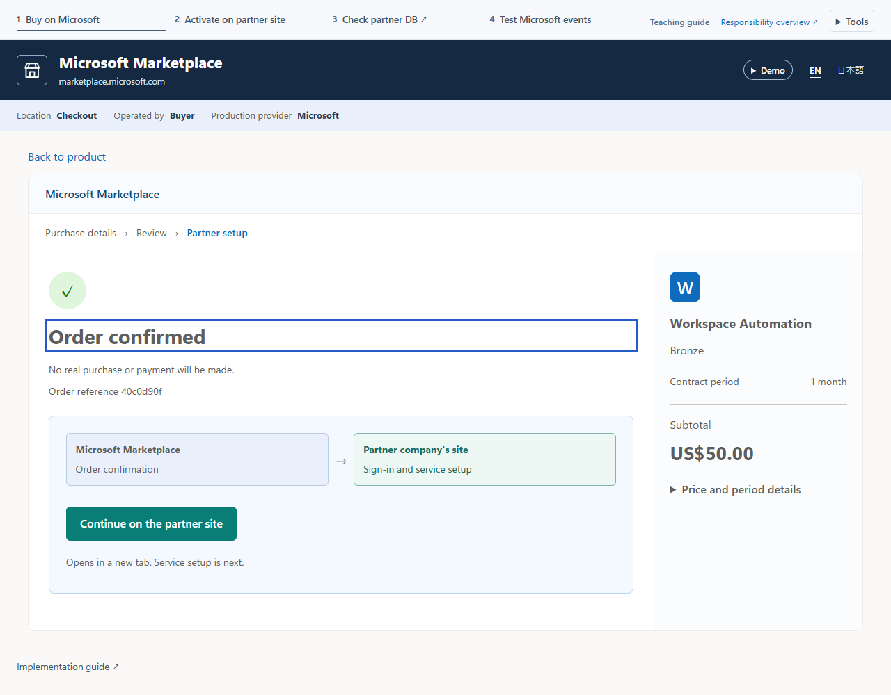
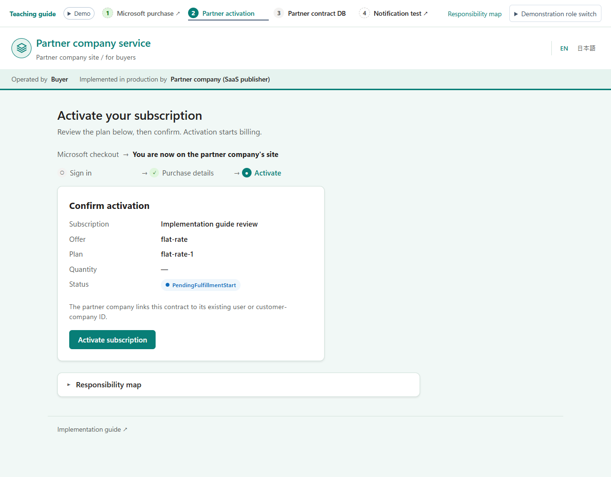
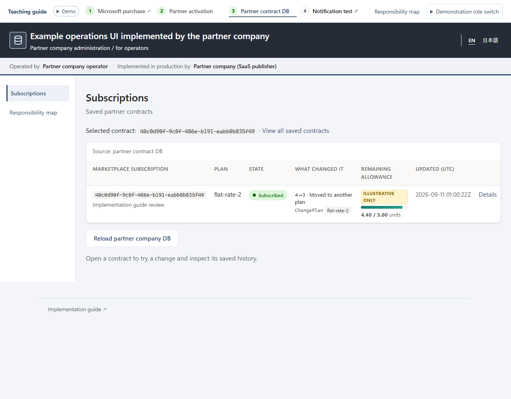
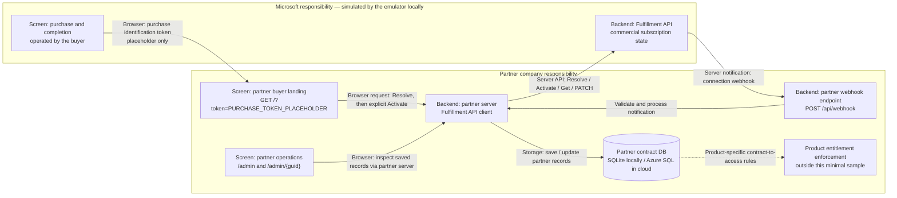

# marketplace-saas-fulfillment-sample

> **Experimental teaching sample — work in progress. Not for production use.**
> A small, readable reference for publishing and operating a **Microsoft Commercial
> Marketplace SaaS Offer** at Tier-1 flat-rate on .NET 10.

> 🌐 日本語版の README は **[README.ja.md](README.ja.md)** をご覧ください。

This sample implements the **partner company (SaaS publisher)** side of a marketplace SaaS
subscription — the "fulfillment plane" that receives commercial subscription information
from Microsoft and stores the partner's contract records:

- a buyer **SSO landing page** (Resolve → explicit-confirm Activate),
- a **connection webhook** (validated server-side),
- a **partner contract database**, and
- a **minimal partner operations console**.

Microsoft provides the production purchase screens and Fulfillment API; the buyer operates
those screens. The partner implements the post-purchase landing page, server-side API calls,
webhook endpoint, and contract storage — **not Microsoft's checkout**. Product-specific
entitlement enforcement and mapping to **existing user/customer-company IDs managed by the
partner company** are responsibilities of the partner but are not implemented by this minimal
sample. A partner company's own ID is not the customer's ID.

You can run it two ways: deploy a **cloud demo** to Azure with one command, or run it entirely
**on your machine** (no Azure). The official
[SaaS Accelerator](https://github.com/Azure/Commercial-Marketplace-SaaS-Accelerator) (MIT)
is used as a reference (not forked), and the
[Fulfillment API Emulator](https://github.com/microsoft/Commercial-Marketplace-SaaS-API-Emulator) (MIT)
stands in for the marketplace, so no real purchase is needed. The emulator is a **vendored
snapshot** of commit `bb7bc6317128605b2f777ebe1c9969198733ae85`, with local teaching UI changes;
it is not fetched from upstream at runtime. See [emulator/NOTICE.md](emulator/NOTICE.md).

**New to marketplace SaaS?** Start with the [experience walkthrough](docs/walkthrough.md) —
try the purchase first, then optionally explore who does what and the code behind it.

## What it looks like

The app's `/` starts with one short sentence and **Start the purchase experience →**, not a required role or
interest selection. The **activation result ends the buyer walkthrough**: it is enough for a
business/sales or buyer demonstration. Inspecting the implementation or operations is optional.
See the [start page](docs/images/screenshots/experience-en-home.png) and
[activation result](docs/images/screenshots/experience-en-result.png).

The four views below show **three responsibility areas**, not numbered journey steps. These screenshots
show the real client UI and partner app using an isolated local HTTP fixture for the emulator APIs.
They use synthetic data — no real purchase or payment, and are not design-approval mockups.
Click an image for full size.

Targeted Node checks passed for this preview: journey (37), experience (14), checkout (18), and
subscription selection (10). These are not the full Jest suite.
The full Node emulator and Jest suite were not validated in this environment: the configured npm
feed returned 404 for required dependencies, and the local Docker engine was unavailable.
Browser checks with the HTTP fixture are not a replacement for full-emulator integration validation.

| | |
| --- | --- |
| **Microsoft purchase area** — navy simulated storefront; operated by the buyer, not built by the partner in production.<br>[](docs/images/screenshots/boundary-en-purchase.png) | **Purchase-to-partner handoff** — **Continue on the partner site** opens the purchased landing; the whole-flow diagram is an optional, initially closed reference.<br>[](docs/images/screenshots/boundary-en-handoff.png) |
| **Partner buyer site** — teal/white buyer-facing header, with **Partner implementation starts here**; Resolve precedes explicit Activate.<br>[](docs/images/screenshots/boundary-en-landing.png) | **Partner operations area** — charcoal header/sidebar for operators; reads contract records actually saved in the partner database.<br>[](docs/images/screenshots/boundary-en-admin.png) |

Microsoft and partner headers remain distinct; the buyer site and operations console are not
same-privilege Home/Admin tabs. **See behind the partner site / 提供元の裏側を見る** is an
optional inspection after the result, showing the actual stored partner state and a direct link
to this contract's `/admin/{guid}`. It is not a required role switch.

Implementation explanations, glossary, code references and suggested reading by interest are in
the [walkthrough](docs/walkthrough.md), not in a second in-app lesson. Each screen has a small
**Implementation guide ↗** footer link to the corresponding English/Japanese repository document.
Links never forward purchase tokens, contract IDs or other query data. Server APIs, authentication,
billing, state transitions and database schema are unchanged.

The console is labelled **Example operations UI implemented by the partner company**.
The partner company handles contract recording and synchronization; this management UI is
optional and may reuse existing tools. Implementation ownership does not make this exact screen mandatory.

**View the whole flow** starts closed in `<details id="boundary">`. The demo retains the whole-flow
map and actual saved results; deeper explanations belong in the repository. Older `#how` bookmarks
land on the implementation-guide link without automatically leaving the demo. The reference map
connects Microsoft purchase, partner activation, partner contract storage, and notification tests;
it is not a mandatory four-step buyer journey. A purchased landing still needs its purchase token.
The UI ships in English and Japanese.

One common small **Demo** disclosure per page explains that the purchase is simulated and does not take
real payment; **Azure hosting may still incur costs**. Order confirmation retains the precise
note that no real order or payment is created. Activation does not implement product entitlements.

## Two ways to run it

| | **Deploy a cloud demo** | **Run locally** |
| --- | --- | --- |
| For | a live URL others can click through the full lifecycle | developing, testing, trying it out |
| Command | `azd up` | `dotnet run` / `dotnet test` |
| Partner contract store | **Azure SQL** — reached passwordless via managed identity | **SQLite** — zero setup, runs on any machine (incl. arm64) |
| Azure needed? | Yes (an Azure subscription) | No |

SQLite is the *local development* partner store; Azure SQL is the partner store used in the
cloud. The UI reads those partner records, not the emulator's separate subscription table.
Neither database replaces Microsoft's commercial state or billing authority. The same app
supports both database providers through configuration.

### Deploy a cloud demo (azd)

One command provisions Azure and deploys three things — the **app**, its **Azure SQL** state
store, and the **Fulfillment API Emulator** (a simulated marketplace, on
Azure Container Apps). The result is a live URL anyone can click through the whole subscription
lifecycle — no local setup, no real purchase. This is the automated version of the step-by-step
[docs/deploy.md](docs/deploy.md). New to `azd`? See the
[Azure Developer CLI docs](https://learn.microsoft.com/en-us/azure/developer/azure-developer-cli/overview).

```bash
# one-time: install the Azure Developer CLI (https://aka.ms/azd-install),
# the Azure CLI, and sqlcmd; then sign in:
azd auth login

azd up      # pick an environment name, subscription, and region
            # → provisions App Service + Azure SQL + the emulator (Container Apps)
            # → deploys everything (a few minutes), then prints the app and emulator URLs

azd down    # remove everything when you're done
```

Buyer sign-in is **off** by default, so there's nothing to configure. `azd up` prints an
**Endpoint** URL for each service — the **emulator** and the **app** (run `azd show` to see them
again). Start at the **app endpoint `/`** and select **Start the purchase experience →**:

1. Open the emulator's **`/start.html`** product page, then **`/checkout.html`**. `web-card`,
   `web-azure`, and `azure-portal` are illustrative purchase routes; none takes real payment.
2. On simulated completion, select **Continue on the partner site**.
   The browser opens the partner's `GET /?token=<purchase-token>` (placeholder only).
3. The partner server calls **Resolve**. The buyer reviews the result and explicitly confirms
   **Activate**. The result completes the buyer walkthrough; there is no required admin step.
4. **Optional:** open **See behind the partner site**, inspect the stored state, and follow the
   direct `/admin/{guid}` link for this same saved contract. A list link using
   `/admin?marketplaceSubscriptionId=<actual-id>` matches only that saved Marketplace ID;
   no match shows an empty result, not another contract or a fabricated detail link.
5. **Optional:** from the detail page, choose **Try a change for this contract**. The emulator's
   `/subscriptions.html?subscriptionId=<actual-marketplace-id>` selects the same contract for
   **Suspend**, **Reinstate**, **Change plan**, or **Unsubscribe** notification tests.
   **Show all** deliberately clears the emulator selection while preserving demo context.
   Its partner-record link uses the configured partner origin and this exact Marketplace ID.
6. **After an optional test:** return to the same partner detail and reload **`#history`** to inspect saved events and the
   recorded plan comparison. An unknown previous plan is **Not recorded**, not inferred from the
   current plan. Delivery and storage are asynchronous; a screen alone does not prove synchronization.

The IDs above are explanatory placeholders. Follow the UI's saved-record links; the partner
record GUID and Marketplace subscription ID serve different purposes.

The emulator's legacy `/` token form and `/landing.html` API test page remain technical tools,
not a Microsoft-provided landing page or the partner's product UI. The supported browser
entry is `/start.html`, not the legacy root **Continue** flow.

For a production-shaped deploy against the **real** marketplace (sign-in on, no emulator, each
step explained), see [docs/deploy.md](docs/deploy.md).

> **Language:** the app UI is available in **English and 日本語**. It follows your browser
> language by default, and a header **EN / 日本語** toggle switches it anytime.

### Run locally

The **automated synthetic L2 test** needs only the
[.NET 10 SDK](https://dotnet.microsoft.com/download/dotnet/10.0): no Docker, Azure, or real
purchase. It hosts the app and an in-repo HTTP fixture, **not the full browser emulator**.

```bash
git clone https://github.com/MamoruKuroda/marketplace-saas-fulfillment-sample
cd marketplace-saas-fulfillment-sample

# Automated HTTP fixture: Resolve → Activate → webhook → partner records.
# Docker-free; does not start the full emulator for browser use.
dotnet test --filter FullyQualifiedName~SyntheticL2LifecycleTests

# Start just the partner app, then open its start page:
dotnet run --project src/SaaSAgentSample.Web
#   → http://localhost:5134/
```

In development the app uses SQLite, buyer sign-in is off, and the Fulfillment client is
configured for the emulator. **`dotnet run` alone does not start that emulator.** Manual
browser purchase/activation needs the vendored Node emulator running separately, either with
its Node/npm dependencies installed and built, or in Docker. Match the app's Fulfillment base
URL, emulator landing URL, and webhook URL to the selected local ports; development defaults
and Docker ports differ.

For setup/configuration see [docs/develop.md](docs/develop.md) and the manual emulator section
of [docs/l2-demo.md](docs/l2-demo.md). Once both processes are running, follow **app `/` → Start
the purchase experience → emulator `/start.html` → `/checkout.html` → Continue on the partner site → partner landing →
explicit Activate → result**. Stop there, or optionally inspect and test the same contract as
above. The technical token-form path in the L2 reference is an API exercise, not the buyer storefront.

<details>
<summary>Terminology (v0, L2, Tier-1…)</summary>

| Term | Meaning |
| --- | --- |
| **Tier-1 flat-rate** | A Microsoft pricing model: one fixed monthly price per subscription (no metered or per-user billing). |
| **Fulfillment plane** | The partner side: landing page, server API calls, connection webhook, and contract store. |
| **v0** | This first version of the sample — everything runs locally. |
| **L2** | An integration-level end-to-end proof: the app talks to a fulfillment API over real HTTP (emulated) and runs the full subscription lifecycle. |
| **Synthetic L2** | The automated in-repo variant — an HTTP stub replaces the Docker emulator, so no Docker is needed. |

</details>

## Architecture

The diagram distinguishes **screens opened by a human**, **server endpoints**, and **storage**.
Microsoft owns the production storefront and Fulfillment API commercial state; the partner
owns the post-purchase implementation. In local demos the vendored emulator substitutes for
Microsoft, without real billing. Deployed as a **cloud demo** with
`azd`, the same pieces run on Azure — the app on App Service, Azure SQL as the state store, and
the Fulfillment API Emulator on Azure Container Apps — so the whole clickable flow works with
nothing installed. (The production-shaped [docs/deploy.md](docs/deploy.md) targets the *real*
marketplace instead of the emulator.)



The arrows show responsibilities, not a claim of instantaneous synchronization. The operations
UI reads partner records only. The emulator's table is separate; it creates its simulated
subscription record at **Resolve**, not by charging a buyer at checkout.

## Solution layout

| Project | Purpose |
| --- | --- |
| `src/SaaSAgentSample.Core` | Domain model (subscription, state, plan); infrastructure-agnostic |
| `src/SaaSAgentSample.Data` | EF Core partner contract store; SQLite / SQL Server / Azure SQL |
| `src/SaaSAgentSample.Fulfillment` | Fulfillment/Operations API v2 client + server-side webhook validation |
| `src/SaaSAgentSample.Web` | Partner buyer landing, connection webhook, partner operations console |
| `tests/SaaSAgentSample.Tests` | Unit + integration (synthetic end-to-end) tests |
| `emulator/` | Vendored Microsoft API emulator snapshot and local teaching screens; see its NOTICE |
| `infra/`, `azure.yaml`, `scripts/` | Authorized `azd` cloud deploy: App Service + Azure SQL + vendored emulator (Container Apps), with deployment hooks |

## Develop & test locally

The [Run locally](#run-locally) quickstart distinguishes the HTTP fixture from the manual browser
experience. For the full local reference — database providers (SQLite / SQL Server / Azure SQL),
migrations, running the
app, configuration, and the SQL Server integration tests — see **[docs/develop.md](docs/develop.md)**.

**Prove it end to end (L2):** run the whole fulfillment lifecycle (Resolve → Activate → webhook →
state) with no real purchase — an automated test drives it over real HTTP, no Docker required:

```bash
dotnet test --filter FullyQualifiedName~SyntheticL2LifecycleTests
```

Details, including the manual emulator path: [docs/l2-demo.md](docs/l2-demo.md).

## Guardrails

A few rules this sample never breaks:

- The partner UI displays saved partner records; Microsoft's Fulfillment API supplies commercial
  subscription information. The separate stores are not asserted to be in sync without evidence.
- `ChangeQuantity` is recorded and acknowledged; the partner domain has no quantity dimension.
  Product entitlements and real account mapping are outside this minimal sample.
- Repository references and saved-record links do not change simulated roles or grant access.
- Buyer/admin activation requires explicit confirmation.
- No purchase/bearer tokens, secrets, or unnecessary PII in logs.
- Webhook validation is server-side (Get Operation, plus Entra JWT when signed-token validation
  is enabled). Local demo signature relaxation is not production authentication.

## Deploy

Target: Azure App Service (.NET 10) + Azure SQL, with the app connecting to the database
passwordless via managed identity. Provisioning is human-authorized — nothing here deploys
automatically.

- **One command:** `azd up` — see [Deploy a cloud demo](#deploy-a-cloud-demo-azd) above. It
  provisions everything defined in `infra/` and deploys the app **and the emulator**, for a
  fully clickable demo.
- **Step by step:** [docs/deploy.md](docs/deploy.md) walks each `az` command — provisioning,
  managed-identity SQL access, app settings, deploy, and wiring the offer's landing page +
  connection webhook. Use it to understand each resource, or for a production-shaped setup.

## Further reading

Existing reference URLs are retained below; they were **not reverified for this documentation
revision**. The local teaching UI is illustrative, not an authoritative description of every
production purchase route.

- SaaS fulfillment APIs: <https://learn.microsoft.com/en-us/partner-center/marketplace-offers/pc-saas-fulfillment-apis>
- SaaS subscription life cycle: <https://learn.microsoft.com/en-us/partner-center/marketplace-offers/pc-saas-fulfillment-life-cycle>
- Implementing a webhook (JWT validation + Get Operation): <https://learn.microsoft.com/en-us/partner-center/marketplace-offers/pc-saas-fulfillment-webhook>
- Register a SaaS application: <https://learn.microsoft.com/en-us/partner-center/marketplace-offers/pc-saas-registration>
- Deploy an ASP.NET web app to App Service: <https://learn.microsoft.com/en-us/azure/app-service/quickstart-dotnetcore>
- Azure Developer CLI (azd): <https://learn.microsoft.com/en-us/azure/developer/azure-developer-cli/overview>
- Connect .NET apps to Azure SQL with managed identity: <https://learn.microsoft.com/en-us/azure/app-service/tutorial-connect-msi-sql-database>
- What is Azure SQL Database: <https://learn.microsoft.com/en-us/azure/azure-sql/database/sql-database-paas-overview?view=azuresql>
- .NET lifecycle (.NET 10 supported to 2028-11-14): <https://learn.microsoft.com/en-us/lifecycle/products/microsoft-net-and-net-core>

## License

[MIT](LICENSE).
