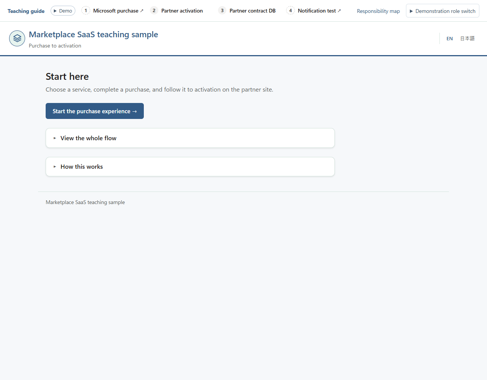
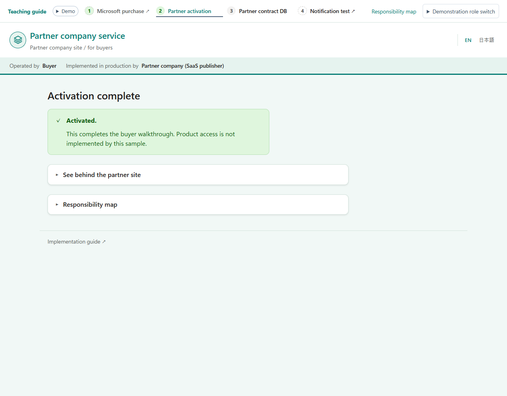

# marketplace-saas-fulfillment-sample

**Experience how a Marketplace SaaS purchase reaches the partner company's service.**
Follow a simulated purchase through the handoff to the partner site and explicit activation,
then optionally inspect the saved contract and notifications behind it.

> Experimental learning sample, not a production-ready service. No real purchase or payment.
> Hosting a demo on Azure may incur costs. Product access and real customer-account linking
> are not implemented.
>
> 日本語: **[README.ja.md](README.ja.md)**

## Try the demo

**Already have a demo URL from its operator?** Open the partner app's `/` and choose
**Start the purchase experience →**. The activation result completes the buyer experience;
opening an operations console is optional. You do not need to read the guide first.

**Need your own environment?** [Prepare the demo](docs/run-demo.md) explains local and Azure
setup. Both standard demo configurations use the emulator, not the real Marketplace.
This repository does not promise an always-available shared demo; use an operator-provided
URL or prepare your own instance.

You can also preview the UI without running it:

| Start the purchase | Activation result |
| --- | --- |
|  |  |

These are screenshots of the sample with synthetic data, not real purchases.
[Capture conditions](docs/develop.md#screenshots-and-evidence) distinguish them from full-emulator verification.

## What the partner company builds

| Responsibility | What this means |
| --- | --- |
| Not the partner's checkout implementation | Microsoft provides the production Marketplace purchase screens. The screens in `emulator` only simulate that side. |
| Implementation to learn from here | The partner buyer landing, server-side Fulfillment API calls, webhook handling, and saved contract records. |
| Work specific to your service | Link contracts to **existing user/customer-company IDs managed by the partner**, enforce product access, and design service operations. These are not completed by this sample. |

The buyer operates the purchase and activation screens. The partner's operations staff can
inspect saved records; that management UI is an example, not a mandatory product design.
Microsoft's commercial state, the partner's saved records, and access to the product are
different things. **Activation success does not mean a finished product integration.**

## Understand or extend what you saw

| Your question | Open |
| --- | --- |
| How do we prepare a demo environment? | [Prepare the demo](docs/run-demo.md) |
| What happened, who implements it, and where is the code? | [Demo implementation guide](docs/walkthrough.md) |
| What is implemented, and what must we add to our service? | [Implementation boundary](docs/walkthrough.md#implementation-boundary) |
| How do we build, configure, or change the sample? | [Develop locally](docs/develop.md) |
| How do we check saved state and notifications? | [Verify the integration](docs/l2-demo.md) |
| What should we review before connecting a real offer? | [Real-Marketplace connection reference](docs/deploy.md) — requires additional implementation |

Each demo screen's **Implementation guide ↗** opens the matching English/Japanese guide in
this repository. It sends no purchase token or contract query data. The demo itself remains
the place to operate the purchase; the guide is an optional explanation, not another required step.

## Solution layout

The partner application uses .NET 10 and Razor Pages. Project names remain unchanged.

| Location | Purpose |
| --- | --- |
| `src/SaaSAgentSample.Web` | Buyer landing, webhook endpoint, example operations UI |
| `src/SaaSAgentSample.Fulfillment` | Fulfillment API client and webhook-token validation |
| `src/SaaSAgentSample.Core` / `Data` | Contract model and persistence (SQLite / SQL Server) |
| `tests` | Automated checks; see the [coverage boundaries](docs/l2-demo.md#automated-checks) |
| `emulator` | Vendored API emulator and local purchase simulation |
| `infra`, `azure.yaml`, `scripts` | Azure demo resources and deployment hooks |
| `docs` | Explanation, preparation, development, and verification |

Build/test instructions live in [develop](docs/develop.md); complete browser-demo setup lives
in [run-demo](docs/run-demo.md). An app-only start or an automated test is not a running storefront.

## Provenance and license

The MIT [SaaS Accelerator](https://github.com/Azure/Commercial-Marketplace-SaaS-Accelerator)
is a reference, not the codebase forked here. The
[Microsoft Fulfillment API Emulator](https://github.com/microsoft/Commercial-Marketplace-SaaS-API-Emulator)
is vendored at `bb7bc6317128605b2f777ebe1c9969198733ae85`, with local teaching UI changes.
It is not downloaded from upstream at runtime. See [emulator/NOTICE.md](emulator/NOTICE.md).
Official Marketplace references are collected in the [implementation guide](docs/walkthrough.md#sources).

## License

[MIT](LICENSE). The emulator retains its own [MIT license](emulator/LICENSE).
