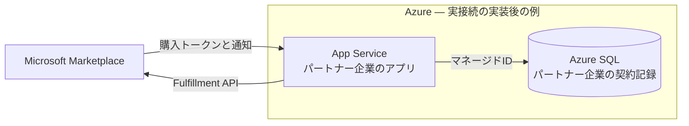

<a id="azure-へのデプロイapp-service--azure-sql"></a>

# 実Marketplace接続の参考（追加実装が必要）

> **人間の承認がある場合のみ。** ここに自動化はなく、プロビジョニングとデプロイは人が実行します。これは
> リファレンス手順です。レビューのうえ、ご自身で実行してください。以下の識別子はすべて
> **プレースホルダ**です — 実テナント/サブスクリプション/パブリッシャー/アプリの ID やシークレットを
> コミットしないでください。

> 🌐 English: **[deploy.md](deploy.md)**

> **動くデモを用意する方は[デモの準備](run-demo.ja.md#azure-demo)へ。**
> 標準の `azd` 構成はエミュレーターを含み、**この実Marketplace構成の自動版ではありません**。
> ローカルデモもAzureデモもエミュレーターを使います。

**これは実オファー向けの完成したデプロイ手順ではありません。**
Azureリソースと接続の例を保持した参考資料です。利用前に[実装範囲](walkthrough.ja.md#implementation-boundary)の
不足部分（APIトークン取得、顧客アカウント対応付け、製品の利用制御、サービス固有の運用）を実装してください。
登録済みの `DevNullMarketplaceTokenProvider` はトークンを返しません。
`Fulfillment:BaseUrl` と `Landing:RequireAuthentication` の変更だけで外向きAPIの認証は実装されません。
今回の文書更新では実オファー・Azureデプロイの検証は行っていません。

不足する連携を完成させた後の、構成の例：

- **Azure App Service**（Linux, .NET 10）が `SaaSAgentSample.Web` をホスト。
- **Azure SQL Database** はパートナー企業の記録を保存。Microsoftの商用課金の正本ではありません。
- **マネージド ID** で App Service → Azure SQL を**パスワードレス**接続（接続文字列にシークレットなし）。
- リージョン：**West US 3**（本サンプルの統合テストで使用した実績から選定）。



## 前提条件

- Azure サブスクリプションと [Azure CLI](https://learn.microsoft.com/en-us/cli/azure/install-azure-cli)。
- オファーのTechnical configurationに登録するアプリによるサービス間API認証
  （[Register a SaaS application](https://learn.microsoft.com/en-us/partner-center/marketplace-offers/pc-saas-registration)参照）。
  サンプルの `AzureAd:*` は別目的のサインイン設定で、このAPIトークンを提供しません。
- 実オファーと、実行承認のある検証計画。エミュレーターだけの準備は[run-demo](run-demo.ja.md)を参照。

## 1. プロビジョニング（例示）

```bash
# Placeholders — replace <...>. Do not paste real IDs/secrets into source control.
LOCATION=westus3
RG=<resource-group>
PLAN=<app-service-plan>
APP=<app-name>                 # becomes https://<app-name>.azurewebsites.net
SQLSERVER=<sql-server-name>
SQLDB=SaasAgentSample

az group create -n "$RG" -l "$LOCATION"

az appservice plan create -g "$RG" -n "$PLAN" --is-linux --sku B1
az webapp create -g "$RG" -p "$PLAN" -n "$APP" --runtime "DOTNETCORE:10.0"

az sql server create -g "$RG" -n "$SQLSERVER" -l "$LOCATION" --enable-ad-only-auth \
  --external-admin-principal-type User \
  --external-admin-name "<aad-admin-upn>" --external-admin-sid "<aad-admin-object-id>"
az sql db create -g "$RG" -s "$SQLSERVER" -n "$SQLDB" --service-objective S0
```

> Azure SQL は **Entra 専用**（`--enable-ad-only-auth`）でプロビジョニングするため、管理すべき SQL
> パスワードがありません。[What is Azure SQL Database](https://learn.microsoft.com/en-us/azure/azure-sql/database/sql-database-paas-overview?view=azuresql) 参照。

## 2. パスワードレス接続（マネージド ID）

アプリにマネージド ID を付与し、contained user としてデータベースへのアクセスを許可します。
[Connect .NET apps to Azure SQL with managed identity](https://learn.microsoft.com/en-us/azure/app-service/tutorial-connect-msi-sql-database) に従います。

```bash
az webapp identity assign -g "$RG" -n "$APP"
```

次に、Entra 管理者としてデータベースに接続し、アプリの ID 用のユーザーを作成して最小権限ロールを
付与します：

```sql
CREATE USER [<app-name>] FROM EXTERNAL PROVIDER;
ALTER ROLE db_datareader ADD MEMBER [<app-name>];
ALTER ROLE db_datawriter ADD MEMBER [<app-name>];
ALTER ROLE db_ddladmin  ADD MEMBER [<app-name>];   -- needed for EF Core Migrate() on startup
```

接続文字列に**シークレットは含まれません** — 認証はマネージド ID です：

```
Server=tcp:<sql-server-name>.database.windows.net,1433;Database=SaasAgentSample;Authentication=Active Directory Default;Encrypt=True;
```

## 3. アプリ設定

不足する連携の実装後に、以下のApp Service設定を検討します（ネストキーは `__`）。
IDはすべてプレースホルダです。接続の例であり、既存の共有デモを切り替える指示ではありません。

```bash
az webapp config appsettings set -g "$RG" -n "$APP" --settings \
  Database__Provider=SqlServer \
  "Database__ConnectionString=Server=tcp:$SQLSERVER.database.windows.net,1433;Database=$SQLDB;Authentication=Active Directory Default;Encrypt=True;" \
  Landing__RequireAuthentication=true \
  AzureAd__Instance=https://login.microsoftonline.com/ \
  AzureAd__TenantId=common \
  AzureAd__ClientId=<landing-app-client-id> \
  Fulfillment__BaseUrl=https://marketplaceapi.microsoft.com/api \
  Fulfillment__ApiVersion=2018-08-31 \
  Fulfillment__Webhook__Audience=<publisher-app-client-id> \
  Fulfillment__Webhook__ExpectedAppId=20e940b3-4c07-4bc1-a733-45f7c7a3d0e3 \
  Fulfillment__Webhook__MetadataAddress=https://login.microsoftonline.com/common/v2.0/.well-known/openid-configuration \
  Fulfillment__Webhook__RequireSignedToken=true
```

補足：

- 実Webhookには公式のJWT検証が必要です。標準のローカル・Azureデモの
  `RequireSignedToken=false` はエミュレーター用の緩和で、本番の認証ではありません。
- `ExpectedAppId` は既定で**公開**の Microsoft Marketplace アプリ ID `20e940b3-…`（文書化された定数で
  あり、シークレットではありません）。
- 機微とみなす値には [Key Vault references](https://learn.microsoft.com/en-us/azure/app-service/app-service-key-vault-references)
  を推奨。マネージド ID により**データベースのシークレットは保存不要**です。

## 4. アプリのデプロイ

```bash
dotnet publish src/SaaSAgentSample.Web -c Release -o ./publish
cd publish && zip -r ../app.zip . && cd ..
az webapp deploy -g "$RG" -n "$APP" --src-path app.zip --type zip
```

初回起動時、SQL Server 経路では権威ある EF Core マイグレーション（`Database.Migrate()`）が実行され、
スキーマが作成されます。[Deploy an ASP.NET web app](https://learn.microsoft.com/en-us/azure/app-service/quickstart-dotnetcore) 参照。

<a id="marketplace-reference"></a>
## 5. マーケットプレースオファーの配線（Partner Center）

SaaS オファーの **Technical configuration** で：

| 項目 | 値 |
| --- | --- |
| Landing page URL | `https://<app-name>.azurewebsites.net/` |
| Connection webhook | `https://<app-name>.azurewebsites.net/api/webhook` |
| Microsoft Entra tenant ID | `<your-tenant-id>` |
| Microsoft Entra application ID | `<publisher-app-client-id>` |

テナント/アプリ ID は、フルフィルメント API 認証に使うアプリ登録のものです
（[Register a SaaS application](https://learn.microsoft.com/en-us/partner-center/marketplace-offers/pc-saas-registration)、
[Implementing a webhook](https://learn.microsoft.com/en-us/partner-center/marketplace-offers/pc-saas-fulfillment-webhook) 参照）。

掲載・プレビュー・公開はサンプルの実装とは別の作業です。模擬購入経路の表示を、
実オファーの購入許可と同一視しないでください。
以下は旧体験ウォークスルーから保持したリンクで、**今回の更新では再取得していません（未検証）**。
最新のポリシー助言ではなく、実際の条件を確認するための参考先です。

- [SaaSオファーの作成](https://learn.microsoft.com/en-us/partner-center/marketplace-offers/create-new-saas-offer)
- [レビューと公開](https://learn.microsoft.com/en-us/partner-center/marketplace-offers/review-publish-offer)
- [購読ライフサイクル](https://learn.microsoft.com/en-us/partner-center/marketplace-offers/pc-saas-fulfillment-life-cycle)
- [Web購入要件](https://learn.microsoft.com/en-us/marketplace/purchase-software-appsource)
- [第三者SaaSのセルフサービス購入ポリシー](https://learn.microsoft.com/en-us/microsoft-365/commerce/subscriptions/allowselfservicepurchase-powershell?view=o365-worldwide#use-allowselfservicepurchase-with-third-party-offer-types)
- [MCA請求プロファイルのロール](https://learn.microsoft.com/en-us/microsoft-365/commerce/billing-and-payments/manage-billing-profiles?view=o365-worldwide#assign-billing-profile-roles)
- [Azure購入要件](https://learn.microsoft.com/en-us/marketplace/purchase-saas-offer-in-azure-portal#requirements)
- [Private Marketplace](https://learn.microsoft.com/en-us/marketplace/create-manage-private-azure-marketplace-new)
- [ランディングのサインイン・再訪](https://learn.microsoft.com/en-us/partner-center/marketplace-offers/azure-ad-transactable-saas-landing-page)

## 6. 確認

- `https://<app-name>.azurewebsites.net/admin` を開く（本番ではサインイン必須）。
- 不足部分の実装後、別途承認された計画で実オファーを検証します。管理画面の状態だけでなく、
  顧客アクセスや障害復旧も確認します。[エミュレーターでの検証](l2-demo.ja.md)はその代わりにはなりません。

## 7. 破棄（teardown）

データを削除する操作です。自分が作成し、削除の承認があるリソースだけを対象に `$RG` を確認してください。
azd管理のデモは[専用の終了手順](run-demo.ja.md#azureデモを削除する)を使います。

```bash
az group delete -n "$RG" --yes --no-wait
```

## Azure 上のガードレール

- DBは**パートナー企業の画面が表示する保存記録**の正本です。
  商用状態・課金・製品アクセスすべての権威ではありません。
- **可能な限りソースや app settings にシークレットを置かない** — SQL はマネージド ID、その他は
  Key Vault references。本ドキュメントの ID はプレースホルダです。
- Webhook の Authorization 検証は**サーバー側**（Entra JWT + Get Operation）のままです。

<a id="出典2026-07-18-に-http-200-で取得確認"></a>
## 出典と確認状況

旧文書には2026-07-18の確認日が記録されていました。
今回、**サービス登録・Webhook検証・マネージドIDによるSQL接続の記事は2026-09-12に取得確認**しました。
以下の他の既存リンクは再検証していません。コマンド例のデプロイも行っていません。
[今回確認した連携資料](walkthrough.ja.md#sources)も参照してください。

- Deploy an ASP.NET web app to App Service: <https://learn.microsoft.com/en-us/azure/app-service/quickstart-dotnetcore>
- Connect .NET apps to Azure SQL with managed identity: <https://learn.microsoft.com/en-us/azure/app-service/tutorial-connect-msi-sql-database>
- What is Azure SQL Database: <https://learn.microsoft.com/en-us/azure/azure-sql/database/sql-database-paas-overview?view=azuresql>
- Register a SaaS application: <https://learn.microsoft.com/en-us/partner-center/marketplace-offers/pc-saas-registration>
- Implementing a webhook: <https://learn.microsoft.com/en-us/partner-center/marketplace-offers/pc-saas-fulfillment-webhook>
