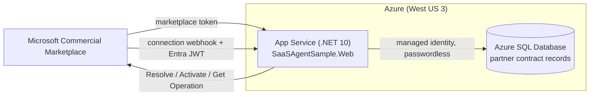

<a id="deploy-to-azure-app-service--azure-sql"></a>

# Real-Marketplace connection reference (additional implementation required)

> **Human-authorized only.** Nothing here is automated — provisioning and deployment are performed by a person. This is a reference
> walkthrough; run it yourself after reviewing. All identifiers below are **placeholders** —
> never commit real tenant, subscription, publisher, or app IDs, or any secret.

> 🌐 日本語版: **[deploy.ja.md](deploy.ja.md)**

> **Looking for a working demo?** Use [Prepare the demo](run-demo.md#azure-demo).
> The standard `azd` configuration includes the emulator; it is **not an automated equivalent
> of this real-Marketplace configuration**. Local and Azure demos both use that emulator.

**This is not a complete deployment recipe for a real offer.** It retains illustrative Azure
resource and connection examples. Before using them, implement the missing API token provider,
customer-account mapping, product access rules and service-specific operations described in the
[implementation boundary](walkthrough.md#implementation-boundary). The registered
`DevNullMarketplaceTokenProvider` returns no token; changing `Fulfillment:BaseUrl` and
`Landing:RequireAuthentication` does not implement outbound API authentication.
No live-offer or Azure deployment verification was performed for this documentation update.

Illustrative topology after completing the missing integration:

- **Azure App Service** (Linux, .NET 10) hosts `SaaSAgentSample.Web`.
- **Azure SQL Database** stores the partner's records, not Microsoft's commercial billing authority.
- **Managed identity** connects App Service → Azure SQL **passwordless** (no connection-string secret).
- Region: **West US 3** (chosen for prior integration testing in this sample).



## Prerequisites

- An Azure subscription and the [Azure CLI](https://learn.microsoft.com/en-us/cli/azure/install-azure-cli).
- Service-to-service API authentication using the app registered in the offer's Technical
  configuration (see [Register a SaaS application](https://learn.microsoft.com/en-us/partner-center/marketplace-offers/pc-saas-registration)).
  The sample's `AzureAd:*` sign-in settings have a different purpose and do not supply that token.
- A real offer and an authorized validation plan. The emulator-only preparation belongs in [run-demo](run-demo.md).

## 1. Provision (illustrative)

```bash
# Placeholders — replace <...>. Do not paste real IDs/secrets into source control.
LOCATION=westus3
RG=<resource-group>
PLAN=<app-service-plan>
APP=<app-name>                 # becomes https://<app-name>.azurewebsites.net
SQLSERVER=<sql-server-name>
SQLDB=SaasAgentSample

az group create -n "$RG" -l "$LOCATION"

az appservice plan create -g "$RG" -n "$PLAN" --is-linux --sku B1
az webapp create -g "$RG" -p "$PLAN" -n "$APP" --runtime "DOTNETCORE:10.0"

az sql server create -g "$RG" -n "$SQLSERVER" -l "$LOCATION" --enable-ad-only-auth \
  --external-admin-principal-type User \
  --external-admin-name "<aad-admin-upn>" --external-admin-sid "<aad-admin-object-id>"
az sql db create -g "$RG" -s "$SQLSERVER" -n "$SQLDB" --service-objective S0
```

> Azure SQL is provisioned **Entra-only** (`--enable-ad-only-auth`) so there is no SQL password to
> manage. See [What is Azure SQL Database](https://learn.microsoft.com/en-us/azure/azure-sql/database/sql-database-paas-overview?view=azuresql).

## 2. Passwordless connection (managed identity)

Give the app a managed identity and grant it access to the database as a contained user. This
follows [Connect .NET apps to Azure SQL with managed identity](https://learn.microsoft.com/en-us/azure/app-service/tutorial-connect-msi-sql-database).

```bash
az webapp identity assign -g "$RG" -n "$APP"
```

Then, connected to the database as the Entra admin, create a user for the app's identity and grant
least-privilege roles:

```sql
CREATE USER [<app-name>] FROM EXTERNAL PROVIDER;
ALTER ROLE db_datareader ADD MEMBER [<app-name>];
ALTER ROLE db_datawriter ADD MEMBER [<app-name>];
ALTER ROLE db_ddladmin  ADD MEMBER [<app-name>];   -- needed for EF Core Migrate() on startup
```

The connection string carries **no secret** — authentication is the managed identity:

```
Server=tcp:<sql-server-name>.database.windows.net,1433;Database=SaasAgentSample;Authentication=Active Directory Default;Encrypt=True;
```

## 3. App settings

Only after completing the missing integration, review these App Service settings
(nested keys use `__`). All IDs are placeholders. This is a connection example, not an
instruction to convert an existing shared demo.

```bash
az webapp config appsettings set -g "$RG" -n "$APP" --settings \
  Database__Provider=SqlServer \
  "Database__ConnectionString=Server=tcp:$SQLSERVER.database.windows.net,1433;Database=$SQLDB;Authentication=Active Directory Default;Encrypt=True;" \
  Landing__RequireAuthentication=true \
  AzureAd__Instance=https://login.microsoftonline.com/ \
  AzureAd__TenantId=common \
  AzureAd__ClientId=<landing-app-client-id> \
  Fulfillment__BaseUrl=https://marketplaceapi.microsoft.com/api \
  Fulfillment__ApiVersion=2018-08-31 \
  Fulfillment__Webhook__Audience=<publisher-app-client-id> \
  Fulfillment__Webhook__ExpectedAppId=20e940b3-4c07-4bc1-a733-45f7c7a3d0e3 \
  Fulfillment__Webhook__MetadataAddress=https://login.microsoftonline.com/common/v2.0/.well-known/openid-configuration \
  Fulfillment__Webhook__RequireSignedToken=true
```

Notes:

- Real webhooks need the documented JWT validation. `RequireSignedToken=false` in both standard
  local and Azure demos is an emulator relaxation, not production authentication.
- `ExpectedAppId` defaults to the **public** Microsoft Marketplace app id `20e940b3-…` (a documented
  constant, not a secret).
- Prefer [Key Vault references](https://learn.microsoft.com/en-us/azure/app-service/app-service-key-vault-references)
  for any value you consider sensitive. Managed identity means there is **no database secret** to store.

## 4. Deploy the app

```bash
dotnet publish src/SaaSAgentSample.Web -c Release -o ./publish
cd publish && zip -r ../app.zip . && cd ..
az webapp deploy -g "$RG" -n "$APP" --src-path app.zip --type zip
```

On first start the SQL Server path runs the authoritative EF Core migration
(`Database.Migrate()`), creating the schema. See
[Deploy an ASP.NET web app](https://learn.microsoft.com/en-us/azure/app-service/quickstart-dotnetcore).

<a id="marketplace-reference"></a>
## 5. Wire up the marketplace offer (Partner Center)

In the SaaS offer's **Technical configuration**:

| Field | Value |
| --- | --- |
| Landing page URL | `https://<app-name>.azurewebsites.net/` |
| Connection webhook | `https://<app-name>.azurewebsites.net/api/webhook` |
| Microsoft Entra tenant ID | `<your-tenant-id>` |
| Microsoft Entra application ID | `<publisher-app-client-id>` |

The tenant/app IDs are the app registration used to authenticate to the fulfillment APIs
(see [Register a SaaS application](https://learn.microsoft.com/en-us/partner-center/marketplace-offers/pc-saas-registration)
and [Implementing a webhook](https://learn.microsoft.com/en-us/partner-center/marketplace-offers/pc-saas-fulfillment-webhook)).

Listing, preview and publishing are separate from this sample's implementation.
Do not equate a simulated purchase route with permission to buy a real offer.
The following links were retained from the former experience walkthrough; **they were not
re-fetched for this update** and are references to check, not freshly validated policy advice:

- [Create a SaaS offer](https://learn.microsoft.com/en-us/partner-center/marketplace-offers/create-new-saas-offer)
- [Review and publish an offer](https://learn.microsoft.com/en-us/partner-center/marketplace-offers/review-publish-offer)
- [Subscription lifecycle](https://learn.microsoft.com/en-us/partner-center/marketplace-offers/pc-saas-fulfillment-life-cycle)
- [Web purchase requirements](https://learn.microsoft.com/en-us/marketplace/purchase-software-appsource)
- [Third-party SaaS self-service policy](https://learn.microsoft.com/en-us/microsoft-365/commerce/subscriptions/allowselfservicepurchase-powershell?view=o365-worldwide#use-allowselfservicepurchase-with-third-party-offer-types)
- [MCA billing-profile roles](https://learn.microsoft.com/en-us/microsoft-365/commerce/billing-and-payments/manage-billing-profiles?view=o365-worldwide#assign-billing-profile-roles)
- [Azure purchase requirements](https://learn.microsoft.com/en-us/marketplace/purchase-saas-offer-in-azure-portal#requirements)
- [Private Marketplace](https://learn.microsoft.com/en-us/marketplace/create-manage-private-azure-marketplace-new)
- [Landing sign-in and return visits](https://learn.microsoft.com/en-us/partner-center/marketplace-offers/azure-ad-transactable-saas-landing-page)

## 6. Verify

- Browse `https://<app-name>.azurewebsites.net/admin` (sign-in required in production).
- After the missing implementation is complete, verify a real offer under a separately approved
  plan, including customer access and failure recovery, not just an admin state badge.
  Emulator checks in [integration verification](l2-demo.md) do not substitute for that validation.

## 7. Tear down

Destructive: only for resources you created and are authorized to remove. Check `$RG` first.
For an azd-managed demo use [its own cleanup instructions](run-demo.md#remove-an-azure-demo).

```bash
az group delete -n "$RG" --yes --no-wait
```

## Guardrails on Azure

- The DB is the source of the **partner UI's saved records**, not the authority for all
  commercial state, billing, or product access.
- **No secrets in source or app settings** where avoidable — managed identity for SQL, Key Vault
  references for anything else. IDs in this doc are placeholders.
- Webhook Authorization validation stays **server-side** (Entra JWT + Get Operation).

<a id="sources-fetched-http-200-on-2026-07-18"></a>
## Sources and verification status

The previous document recorded 2026-07-18 as its source-check date. In this update,
**service registration, webhook validation, and the managed-identity SQL tutorial were
retrieved on 2026-09-12**. Other retained links below were not reverified.
The examples were not deployed. See also the [current integration sources](walkthrough.md#sources).

- Deploy an ASP.NET web app to App Service: <https://learn.microsoft.com/en-us/azure/app-service/quickstart-dotnetcore>
- Connect .NET apps to Azure SQL with managed identity: <https://learn.microsoft.com/en-us/azure/app-service/tutorial-connect-msi-sql-database>
- What is Azure SQL Database: <https://learn.microsoft.com/en-us/azure/azure-sql/database/sql-database-paas-overview?view=azuresql>
- Register a SaaS application: <https://learn.microsoft.com/en-us/partner-center/marketplace-offers/pc-saas-registration>
- Implementing a webhook: <https://learn.microsoft.com/en-us/partner-center/marketplace-offers/pc-saas-fulfillment-webhook>
