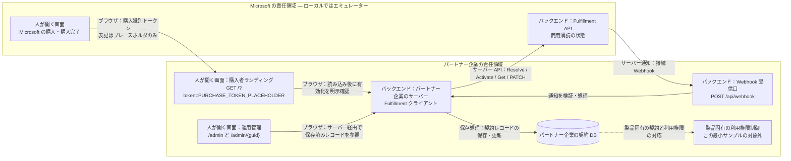
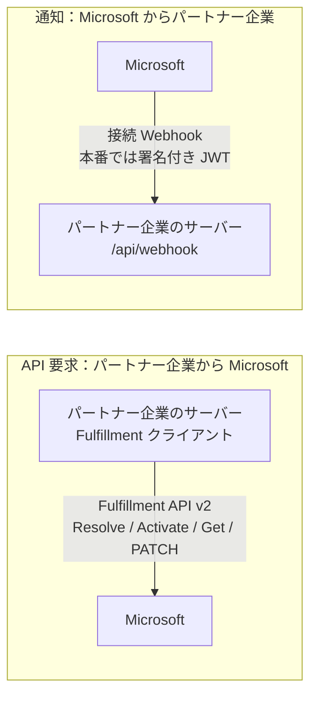

# 体験ウォークスルー：購入者とパートナー企業

Microsoft 商用マーケットプレースで SaaS Offer が販売・運用されるとき、**誰が何をするのか**を平易に
地図化し、それが**本サンプル**のコードにどう対応するかを示します。まず購入を体験し、
各パーツが*なぜ*存在するのかを知りたいときに説明を読めます。教材であり、公式ドキュメント（末尾にリンク）の代わりでは
ありません。

> 🌐 English: **[walkthrough.md](walkthrough.md)**

アプリの `/` は短い説明文1つと **購入体験を始める →** から始まります。
役割や関心を先に選ぶ必要はありません。[購入者の体験](#購入者への引き渡しと運用確認--ローカルのブラウザ体験)
を有効化の結果まで進めれば、営業・事業担当や購入者向けのデモは完結します。実装・運用の深掘りは任意です。

デモは操作と観測できた結果のため、この文書は **何が起きたか → 誰が実装するか → コード**
を学ぶためのものです。画面下部の **実装ガイド ↗** が、表示言語に対応するリポジトリ文書を開きます。
購入トークンやクエリ情報は渡しません。**全体図を見る** と実際の保存記録・変更履歴はデモに残します。
全体図は `<details id="boundary">` 内で初期状態では閉じています。
画面内の「しくみを学ぶ」や関心項目の選択はなくし、以前の `#how` はガイドのリンクに移動するだけにします。

各ページ1つの共通の小さな **デモ（Demo）** 表示に、模擬購入で実決済はないことと、**Azure のホスティング費用は発生し得る**
ことをまとめています。注文確認には「実際の注文・決済は行われない」という正確な注意書きを残しています。

<details>
<summary>参考：用語</summary>

> **クイック用語集** — 本ドキュメントで使う用語：
> - **v0**：本サンプルの初期バージョン（全コンポーネントをローカルで動作）。
> - **Tier-1 定額（flat-rate）**：購読ごとに月額固定価格を1つ（従量課金・ユーザー数課金なし）。
> - **L2 ウォークスルー**：統合レベルのエンドツーエンド実証 — 模擬 Fulfillment API を使い、実 HTTP 上で購読ライフサイクルを駆動。
> - **合成 L2（Synthetic L2）**：自動化された in-repo バリアント。Docker エミュレーターを HTTP スタブで置換（Docker 不要）。
> - **L3**：実マーケットプレース購入・実購入者アカウントでのライブなエンドツーエンドテスト（本サンプルの対象外）。

</details>

---

## 3人の登場人物

| 登場人物 | たとえ | 役割 |
| --- | --- | --- |
| **Microsoft** | **お店** | 本番の購入画面と Fulfillment API を提供し、商用購読の状態・顧客への課金を管理して購読通知を送る。ローカルのエミュレーターはその代役。 |
| **パートナー企業（SaaS パブリッシャー）** | **メーカー** | SaaS Offer を掲載し、購入者ランディング・サーバーからの Fulfillment 呼び出し・Webhook 受信口・契約 DB を実装する。利用権限制御とアカウント紐付けも担当するが、この最小サンプルでは未実装。**Microsoft の決済画面は実装しない。** |
| **購入者** | **お客さん** | Microsoft の購入画面を操作し、購入後はパートナー企業の購入者サイトで設定する。通常はパートナー企業とは**別テナント**に所属。パートナー企業の運用担当者とは別の役割。 |

> 購入者は**別テナント**なので、ランディングページのサインインは**マルチテナント**でなければなりません
> （各購入者テナントが同意）。本サンプルではそれが `AzureAd`（authority `common`）のランディングアプリで、
> フルフィルメント API を呼ぶ**サービスアプリとは別物**です。ローカルのデモでは購入者サインインを
> 無効にしています。新しい画面ラベルによってこの認証動作が変わるわけではありません。

---

## 責任境界 — 画面・サーバー・保存先

管理画面は **パートナー企業が実装する運用管理画面の例** です。
契約の記録・同期はパートナー企業が担当します。この管理UIは任意で、既存の管理機能でも構いません。
実装主体の明示は、この画面の新規作成が必須という意味ではありません。

Microsoft とパートナー企業で異なるヘッダーを使って提供主体と操作する人を示し、
共通の製品ナビゲーションにはしません。全体図や説明の参照は任意です。

| 領域 | 操作する人 | 外観・実装範囲 |
| --- | --- | --- |
| Microsoft の模擬ストア | 購入者 | 紺色の購入ヘッダー。本番の決済画面は Microsoft が提供し、パートナー企業は実装しない。 |
| **パートナー企業のサイト / 購入者向け** | 購入者 | 青緑と白のヘッダー。購入後のランディングで **ここからパートナー企業が実装** と明示。 |
| **パートナー企業の管理領域 / 運用担当者向け** | パートナー企業の運用担当者 | チャコールのヘッダーとサイドバー。購入者ナビゲーションとは別で、保存済み契約を確認する。 |

必須の役割切替手順や、同じ権限のホーム／管理ナビゲーションはありません。結果の後で任意の
**提供元の裏側を見る / See behind the partner site** を開くと、実際の保存状態と、
この契約の運用管理詳細への直接リンクを確認できます。

職種ごとの見どころは以下を参考にしてください。アプリ内の選択ゲートではありません。
参加者の職種とデモ内で演じる役は別で、リンクから認証や権限が付与されることもありません。
サーバーAPI・認証・課金・状態遷移・DBスキーマは変更しません。

| 関心 | 見どころ |
| --- | --- |
| 営業・事業 | 何を購入し、どこからパートナー企業に渡り、有効化で何が完了するか |
| 購入企業 | 購入権限、アカウント設定、完了結果 |
| 実装 | サーバー呼び出し、通知の検証、顧客IDの対応付け、下記の関連コード |
| 運用 | 保存された契約を開き、一度変更してプラン・状態・履歴を確認 |



購入識別トークンは購入者のサインイントークンでも、パートナー企業側で使う顧客アカウント ID でも
ありません。本来の連携では、解決した購入情報を **パートナー企業が管理する既存ユーザー／顧客企業ID**
に紐付けます。パートナー企業自身の ID が顧客の ID という意味ではありません。
このサンプルでは実アカウントへの紐付けや製品アクセス制御は未実装です。
Activate の成功だけでは製品の利用権限制御が実装済みとはいえません。

パートナー企業の UI はパートナー企業の DB レコードだけを読み取ります。
Microsoft の商用状態（ローカルではエミュレーターの別テーブル）、パートナー企業の契約 DB、
製品へのアクセスは別々の責任であり、「1つの DB がすべての課金の正本」という意味ではありません。

---

## 購入者への引き渡しと運用確認 — ローカルのブラウザ体験

**アプリ `/`** の **購入体験を始める →** からエミュレーターの **`/start.html`** へ進みます。
先に全体図を開いたり関心項目を選んだりする必要はありません。旧トップページのトークンフォームは購入体験の入口ではありません。

1. **Microsoft の模擬画面を購入者が操作：** `/start.html` でオファー／プランを選び、
   `/checkout.html` に進みます。`web-card`・`web-azure`・`azure-portal` は経路の説明用であり、
   すべての本番オファーで利用可能と保証するものではありません。実決済、実カード情報の収集、
   Azure での実購入やリソース作成は行いません。
   今回の表示変更で、3つの購入経路と購入トークンの引き渡しは変えていません。
2. **責任境界の引き渡し：** 模擬購入完了で、次の行き先がパートナー企業のサイトであることを示します。
   **パートナー企業のサイトで設定する** はブラウザで `GET /?token=<purchase-token>` を開きます。
   この表記はプレースホルダです。設定値だけ、シナリオ情報だけ、トークンなしのリンクだけでは
   有効な購入済みランディングを作れません。
3. **パートナー企業の購入者サイト：** サーバーが **Resolve** でトークンを購読情報に引き換えます。
   本番の Marketplace トークンをローカルで「復号」する処理ではありません。
   購入者が内容を確認し、**Activate** を明示実行します。エミュレーターの模擬購読レコードが
   作成されるのは Resolve 時であり、購入画面で実際に課金するわけではありません。
4. **結果：** 有効化によって購入者の体験は完了します。ここで終えて構いません。管理画面を開くことは
   必須の次の操作ではありません。確認できるのはサンプルの有効化フローであり、製品の利用権限制御や
   実顧客アカウントとの紐付けが実装済みという意味ではありません。

参考の地図にはパートナー企業の契約保存と通知テストも含まれますが、購入者の必須手順ではありません。
有効な購入済みランディングには、引き続き模擬購入完了からトークン付きで引き渡す必要があります。
参考情報は購入を省略するショートカットではありません。

### 任意：提供元の裏側で同じ契約をたどる

実装・運用を確認したい場合だけ、結果から先へ進みます：

1. **提供元の裏側を見る** を開き、今回の購入についてパートナー企業側に実際に保存された状態を確認します。
   **`/admin/{guid}`** の直接リンクで同じ契約へ進みます。このGUIDは保存済みのパートナー企業側レコードのもので、
   Marketplace の購読IDとは別です。レコードがなければ架空の詳細リンクは表示しません。
2. **`/admin?marketplaceSubscriptionId=<actual-id>`** の一覧を開いた場合は、保存済みの Marketplace 購読IDに
   完全一致で絞り込みます。未知のIDなら一致するレコードがないことを明示し、全件・部分一致・別契約を表示しません。
   これらの画面はパートナー企業のDBを読み取り、エミュレーターの購読テーブルを表示するものではありません。
   エミュレーターからの保存記録リンクは、設定済みのパートナー企業側オリジン上のこのパスに、
   選択した購読の実際のIDを付けて開きます。
3. 詳細画面の **この契約の変更を試す（Try a change for this contract）** から、
   エミュレーターの **`/subscriptions.html?subscriptionId=<actual-marketplace-id>`** へ進みます。
   同じ購読が選択されるので、**Change plan**・**Suspend**・**Reinstate**・**Unsubscribe** を試せます。
   この通知ツールは購入者向けストアのタブではありません。**Show all** はデモの文脈を保ったまま
   エミュレーターの選択を明示的に解除します。一致しないIDから別の契約を勝手に選択しません。
4. 同じ契約の **`/admin/{guid}#history`** に戻って再読み込みし、実際の保存イベントと記録に基づくプラン比較を確認します。
   以前のプランには、過去の保存イベントのうちプランを含む直近の記録を使います。プランを含まないイベントからは取得しません。
   過去の記録がなければ **記録なし（Not recorded）** と表示し、現在のプランから以前の値を推測しません。

上記URLの値はプレースホルダです。実際の保存済みIDを含むUIのリンクを使ってください。
配信と保存は非同期です。再読み込み後の記録を確認し、証拠なしに「同期済み」「見えない更新は反映待ち」とは
判断しません。これらの参照リンクによって、ロールの権限が変わったり製品アクセスが実装されたりすることはありません。

### 技術ツールは製品体験とは別

- エミュレーターの **`/`** は従来のトークン生成フォームです。
- エミュレーターの **`/landing.html`** は API テストページであり、Microsoft が提供する
  ランディングでもパートナー企業の製品 UI でもありません。
- エミュレーターの **`/subscriptions.html`** はデモ運用担当者のイベントツールです。
  顧客向けストアのタブではありません。
- 任意の参考情報や裏側を見るリンクはデモをつなぐもので、本番のアクセス権をつなぐものではありません。

### 動作中のローカルサンプルの画面

実際のUIとパートナー企業側のアプリを、エミュレーターAPI用の隔離したHTTPフィクスチャで動かして撮影しました。
今回のプレビューでは、対象を絞ったNodeチェック（journey 37件、experience 14件、checkout 18件、
購読選択10件）が通過しています。これはJestスイート全体の実行ではありません。
設定済みnpmフィードが必要な依存関係に404を返し、ローカルDockerエンジンも利用できないため、
完全なNodeエミュレーターとJestスイートは未検証です。フィクスチャを使ったブラウザ確認は、
完全なエミュレーターとの統合検証の代わりではありません。全体図は初期状態では閉じた任意の参考情報であり、
これらの画像はすべての説明が展開されていることを前提にしません。

ローカルの合成サンプルデータを使っています。実購入でも、デザイン承認用モック画像でもありません。

| 責任領域 | スクリーンショット |
| --- | --- |
| 説明文1つと購入アクションから開始 | [開始画面](images/screenshots/experience-ja-home.png) |
| Microsoft の模擬購入 | [購入画面](images/screenshots/boundary-ja-purchase.png) |
| 購入完了。全体図の参照は任意 | [パートナー企業のサイトへの引き渡し](images/screenshots/boundary-ja-handoff.png) |
| パートナー企業の購入者サイト | [購入済みランディング](images/screenshots/boundary-ja-landing.png) |
| 購入者の体験完了。深掘りは任意 | [有効化の結果](images/screenshots/experience-ja-result.png) |
| 任意のパートナー企業の運用確認 | [保存済み契約レコード](images/screenshots/boundary-ja-admin.png) |

### 自動テストと手動ブラウザ操作の準備の違い

```bash
dotnet test --filter FullyQualifiedName~SyntheticL2LifecycleTests
```

この既存テストはアプリと **Docker 不要の HTTP フィクスチャ** を動かします。.NET 10 SDK があればよく、
完全なエミュレーターを別途起動する必要はありません。一方、テスト終了後にブラウザで操作できる
ストアが残るわけではありません。手動操作には、アプリと同梱の Node エミュレーターを別途起動します。
エミュレーターには Node/npm の依存関係のインストール・ビルド、または Docker が必要です。
利用ポートに合わせて Fulfillment ベース URL・ランディング URL・Webhook URL を設定します。
[ローカルのクイックスタート](../README.ja.md#ローカルで動かす) と [L2 の設定手順](l2-demo.ja.md) を
参照してください。後者のトークンフォームを使う技術検証と、上記の `/start.html` 購入体験は別です。

エミュレーターはコミット `bb7bc6317128605b2f777ebe1c9969198733ae85` の同梱スナップショットに教材用の
変更を加えたもので、実行時に upstream から取得しません。
出自は [emulator/NOTICE.md](../emulator/NOTICE.md) に記載されています。

---

## パートナー企業の旅 — 公開までの6フェーズ

<!-- GitHub の Mermaid は日本語ラベルを見切れさせるため、PNG を事前生成して埋め込み。ソース: images/ja-publisher-journey.mmd -->


フェーズ3が本サンプルの守備範囲です。フェーズ1〜2 と 5〜6 は Partner Center ポータルでの操作、
フェーズ4はパートナー企業が連携をテストする段階です。本サンプルは
[Fulfillment API Emulator](l2-demo.ja.md) で**実購入なしに**フローを試しますが、
本番オファーのプレビューや検証プロセスを代替するものではありません。

> オファー ID／エイリアスは**作成時に確定し変更不可**。Live のオファーは削除できず、配布停止しかできません。
> （*Create a SaaS offer* 参照）

---

## Technical configuration — 4つの接点

オファーの **Technical configuration** では、4つの項目がマーケットプレースとパートナー企業の実装を
つなぎます。それぞれ本サンプルへの対応は次のとおり：

| Partner Center の項目 | 内容 | 本サンプルでは |
| --- | --- | --- |
| **Landing page URL** | 購入後に購入者が開くパートナー企業のページ（Resolve → Activate）。24×7 稼働が必須。 | `GET /?token=<purchase-token>`。トークンなしの `/` は購入の開始画面 |
| **Connection webhook** | Microsoft が購読変更を POST するエンドポイント。24×7 稼働が必須。 | `POST /api/webhook` |
| **Microsoft Entra tenant ID** | Fulfillment API v2 を呼ぶ**サービスアプリ**のテナント。 | `AzureAd`／トークン設定（プレースホルダ） |
| **Microsoft Entra application ID** | Fulfillment API v2 を呼ぶ資格情報を持つ**サービスアプリ**。 | Fulfillment クライアント認証（プレースホルダ） |

> **サービスアプリ**（フルフィルメント API を呼ぶ）は、**ランディングアプリ**（マルチテナント、購入者
> サインイン用）とは別物です。この画面にはサービスアプリのテナント/アプリ ID のみを設定します。

---

## 購読ライフサイクル — 状態の物語

Microsoft は商用購読のライフサイクルを管理し、パートナー企業は各遷移に反応します。
本サンプルのパートナー企業の契約ストアは、**公式の4状態**をモデル化しています：

<!-- GitHub の Mermaid は日本語ラベルを見切れさせるため、PNG を事前生成して埋め込み。ソース: images/ja-lifecycle.mmd -->


- **前半**（開通）は**ランディングページ**が駆動：Resolve → 明示確認 Activate。
- **後半**（変更／停止／再開／解約）は**接続 Webhook** が駆動。
- **自動開通**の購入は最初の状態を飛ばし、`Subscribed` から始まります。
- `ChangePlan` / `ChangeQuantity` は `Subscribed` のままです。プラン変更は追跡し、
  `ChangeQuantity` は記録・応答しますが、パートナー企業のドメインに**数量項目はありません**。
  本サンプルは **Tier-1 定額**であり、数量課金の実装ではありません。

集約が**遷移を保護**し、不正な遷移を拒否します。パートナー企業の管理画面が示すのは保存済みレコードで、
システム間の同期状況をリアルタイムに判定した結果ではありません。画面を比較するときは、非同期の
Webhook 配信・保存と、エミュレーターのテーブルが別であることを考慮します。
状態に応じた製品固有の利用権限変更は、このサンプルの対象外です。

---

## 呼び出しの向きと、やり取りされる「引換券・名札」

**バックエンド連携**では、Fulfillment 呼び出しは **パートナー企業のサーバー → Microsoft**、
Webhook 通知は **Microsoft → パートナー企業のサーバー** です。購入者のブラウザによる引き渡しは
別種の通信であり、上の責任境界図で分けて示しています。



フローを流れる「券・名札」（記憶に残すためのたとえ）：

| 券・名札 | たとえ | 目的 | 本サンプルでは |
| --- | --- | --- | --- |
| **購入トークン** | 半券 | **Resolve** で購読詳細に引き換える | Resolve の `x-ms-marketplace-token` |
| **`id_token`** | 名札 | 購入者サインイン＝**認証** | ランディングのマルチテナントサインイン |
| **アクセストークン** | 業者証 | サービスアプリが Fulfillment API v2 を呼ぶ**認可** | API 呼び出しのベアラートークン |
| **署名付き JWT** | Microsoft の名札 | **Webhook** 呼び出しに付与。呼び出し元を証明 | サーバー側で検証 |

> **Webhook 検証はサーバー側で行います**：本サンプルは Entra JWT
> （署名/issuer/audience ＋ `appid`/`azp`。`20e940b3-4c07-4bc1-a733-45f7c7a3d0e3` は**公開**の
> Marketplace アプリ ID＝文書化された定数でありシークレットではない）を検証し、状態変更の前に
> **Get Operation** API で Microsoft 側の操作と照合します。
> ローカルのデモ設定ではエミュレーター用に署名検証を緩和しています。
> これは本番用の Webhook 認証ではありません。

---

## 実装リファレンス

以下は以前の画面内の解説を移したものです。サンプルの仕組みを説明する資料であり、
実際の購入権限や本番設定を検証した結果ではありません。

### コードで使う用語

| 用語 | 意味 |
| --- | --- |
| ランディングページ | 購入後、購入識別トークンを伴って開かれるパートナー企業のページ |
| Resolve | 不透明な購入トークンを契約・オファー・プラン・購入者の情報に交換するサーバー呼び出し |
| Activate | 手動有効化フローで開通完了を伝える操作。成功すると課金が始まる |
| Webhook | 変更を非同期に伝える通知。パートナー企業が検証してから保存状態を更新する |
| 状態ストア | Microsoftの商取引上の状態とは別に、パートナー企業が保持する契約記録 |
| 利用権 | 顧客IDと契約を製品の利用制御に結び付けるルール。本サンプルでは未実装 |
| プラン変更 | 同じサブスクリプションのプランを変える。商取引上の価格処理はMicrosoft側 |
| ディメンション | 従量課金の計量単位。この定額サンプルでは未実装 |
| プリペイド容量 | 表示用の利用枠の例。実計量や新しい課金モデルではない |
| フルフィルメント層 | ランディング・API呼び出し・Webhook・契約保存を担う連携部分。SaaS製品そのものではない |

既存のWindows／デスクトップアプリをWebアプリへ作り直す必要はありません。
購入・設定の部分をブラウザーで扱い、既存クライアントとバックエンドを維持する構成にできます。
**パートナー企業が管理する既存ユーザー／顧客企業ID**への紐付けはパートナー企業が設計します。
メールのドメインが同じという理由だけで全社員に利用を許可するものではなく、この実際の対応付けはサンプル外です。

ランディングには初回購入だけでなく、有効化済みの契約から戻る場合もあります。サンプルは返された状態を確認し、
GETで戻っただけでは再度有効化しません。同じブラウザータブの設定リンクは同じ模擬購入を再利用します。
エミュレーターの契約作成は注文確認画面ではなくResolve時です。
自動有効化は別のフローであり、この手動有効化サンプルでは実装していません。

### 購入経路と権限

以前から説明している区別を参照用にまとめます。**デモがこれらを検証するわけではありません**。
実際のオファーやテナントで使う前に、公式資料の最新条件を確認してください。

| 経路・操作 | 区別する点 | 顧客側の管理箇所 |
| --- | --- | --- |
| Webでカード購入 | 組織アカウントとカード。参照元のWeb購入要件は、一律に事前のEntra管理者ロールを要求しているわけではない | 第三者SaaSのセルフサービス購入ポリシー、サインイン制限 |
| 既存のMCA会社請求プロファイル | そのプロファイルで購入する権限（Contributor／Ownerなど）。初めてのカード購入すべてに一律の前提とはしない | Microsoft 365管理センターの請求プロファイルのロール |
| Web／ポータルからAzureで購入 | 対象Azureサブスクリプションと購入権限。閲覧権限だけでは足りない | Azure RBAC、Marketplace購入制御、Private Marketplace |
| 購入後のパートナー企業のランディング | Entraサインイン・同意と、対象の顧客アカウントへの対応付け | 顧客のサインインポリシー、パートナー企業の利用権設計 |

`AllowSelfServicePurchase / OfferType SaaS`はオファー種別の制御で、パートナー企業ごとの許可リストではなく、
Azureポータルからの購入を停止する設定でもありません。MCA請求プロファイルの権限と
MOSAの課金管理者ロールは別で、パートナー企業から顧客の購入制限を上書きすることはできません。

画面から移した参照リンク（今回の文書移動では再取得しておらず、最新内容は未検証）：

- [Web購入要件](https://learn.microsoft.com/en-us/marketplace/purchase-software-appsource)
- [第三者SaaSのセルフサービス購入ポリシー](https://learn.microsoft.com/en-us/microsoft-365/commerce/subscriptions/allowselfservicepurchase-powershell?view=o365-worldwide#use-allowselfservicepurchase-with-third-party-offer-types)
- [MCA請求プロファイルのロール](https://learn.microsoft.com/en-us/microsoft-365/commerce/billing-and-payments/manage-billing-profiles?view=o365-worldwide#assign-billing-profile-roles)
- [Azureでの購入要件](https://learn.microsoft.com/en-us/marketplace/purchase-saas-offer-in-azure-portal#requirements)
- [Private Marketplace](https://learn.microsoft.com/en-us/marketplace/create-manage-private-azure-marketplace-new)
- [ランディングのサインイン・再訪](https://learn.microsoft.com/en-us/partner-center/marketplace-offers/azure-ad-transactable-saas-landing-page)
- [Partner Centerのプレビュー](https://learn.microsoft.com/en-us/partner-center/marketplace-offers/review-publish-offer#publisher-sign-off-phase)

### 関連コードとツールの動作

- [LandingService.cs](../src/SaaSAgentSample.Web/Services/LandingService.cs)：Resolve、明示Activate、契約保存。
- [WebhookService.cs](../src/SaaSAgentSample.Web/Services/WebhookService.cs)：操作の検証、状態更新、応答。
- [EfSubscriptionRepository.cs](../src/SaaSAgentSample.Data/Persistence/EfSubscriptionRepository.cs)：パートナー企業の保存記録。
- [エミュレーターのガイド](../emulator/README.md)：カタログ編集、従来のトークンフォーム、内蔵APIテストページ、イベント操作。

イベントツールのDetail／Stateボタンの色は変更の種類を示し、実装主体や配信保証を示すものではありません。
RenewにHTTP応答があっても状態が変わらない場合があります。何を受信・保存したかはパートナー企業側の
保存履歴で確認し、以前のプラン記録がなければ前後比較でも「記録なし」とします。
カタログを編集したことやエミュレーターのHTTP応答だけでは、パートナー企業側の保存変更は確認できません。

## 各パーツと本サンプルの対応（v0 スコープ）

| 概念 | 本サンプル |
| --- | --- |
| パートナー企業の購入者ランディング（Resolve → 明示 Activate） | `src/SaaSAgentSample.Web` — `GET /?token=<purchase-token>`, `LandingService` |
| 接続 Webhook（サーバー側2段） | `POST /api/webhook`, `WebhookService` + `IWebhookTokenValidator` |
| パートナー企業が保存した契約状態（4状態） | `SaaSAgentSample.Core` 集約 + `SaaSAgentSample.Data` ストア |
| 任意の同じ契約の運用確認（閲覧＋明示 Activate） | `/admin?marketplaceSubscriptionId=<actual-id>`, `/admin/{guid}`, `#history`。保存済みレコードの確認であり購入者ナビゲーションとは別 |
| 参考説明 | このwalkthroughを言語別の実装ガイドから開く。全体図は引き続きデモ内でも参照可能 |
| 製品固有の利用権限制御・実アカウント紐付け | この最小サンプルでは未実装 |
| 実購入なしのテスト | エミュレーター経由の [L2 ウォークスルー](l2-demo.ja.md) — **L2** = HTTP 上の統合レベル実証 |

**v0 スコープ（初期のローカル専用版）：** Tier-1 **定額**のみ（固定価格1つ）。
**v0 の対象外：** 従量課金／ユーザー数課金／製品固有の利用権限制御／実アカウント紐付け／実マーケットプレース購入（L3＝実購入者アカウントでの
ライブ E2E）。実行・設定は [README.ja](../README.ja.md)、
人間承認前提の Azure デプロイは [docs/deploy.ja.md](deploy.ja.md) を参照。

---

## 出典（既存の Microsoft Learn 参考リンク）

リンクと過去の確認日は既存ドキュメントから引き継いでいます。
**今回の改訂では再検証していません（未検証）**。新たな取得確認を主張するものではありません。

従来記録されていた確認日：2026-07-21：

- Create a SaaS offer: <https://learn.microsoft.com/en-us/partner-center/marketplace-offers/create-new-saas-offer>
- Add technical details for a SaaS offer: <https://learn.microsoft.com/en-us/partner-center/marketplace-offers/create-new-saas-offer-technical>
- Review and publish an offer: <https://learn.microsoft.com/en-us/partner-center/marketplace-offers/review-publish-offer>

従来記録されていた確認日：2026-07-18：

- SaaS fulfillment APIs: <https://learn.microsoft.com/en-us/partner-center/marketplace-offers/pc-saas-fulfillment-apis>
- SaaS subscription life cycle: <https://learn.microsoft.com/en-us/partner-center/marketplace-offers/pc-saas-fulfillment-life-cycle>
- Implementing a webhook: <https://learn.microsoft.com/en-us/partner-center/marketplace-offers/pc-saas-fulfillment-webhook>
- Register a SaaS application: <https://learn.microsoft.com/en-us/partner-center/marketplace-offers/pc-saas-registration>
