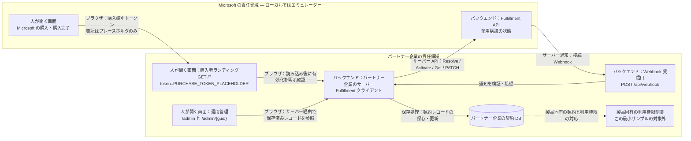
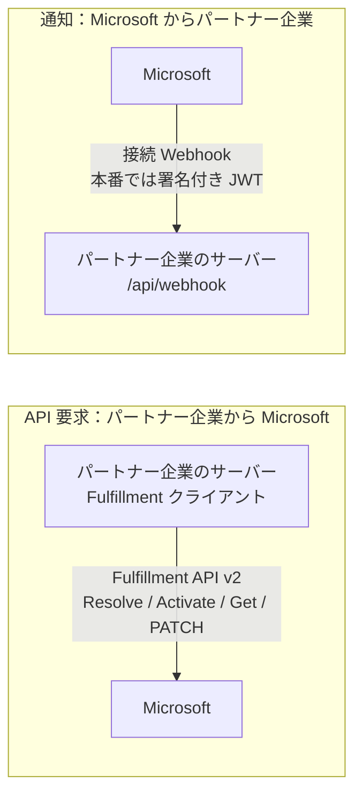

# 体験ウォークスルー：購入者とパートナー企業

Microsoft 商用マーケットプレースで SaaS Offer が販売・運用されるとき、**誰が何をするのか**を平易に
地図化し、それが**本サンプル**のコードにどう対応するかを示します。コードを読む前にこれを読むと、
各パーツが*なぜ*存在するのかがつかめます。教材であり、公式ドキュメント（末尾にリンク）の代わりでは
ありません。

> 🌐 English: **[walkthrough.md](walkthrough.md)**

手法は**責任の地図**です。人が操作する画面と、その裏側のサーバー呼び出し・保存先を区別し、
購入の引き渡しから購読ライフサイクルをたどります。ローカルの購入経路はすべて説明用で、
実決済はありません。

> **クイック用語集** — 本ドキュメントで使う用語：
> - **v0**：本サンプルの初期バージョン（全コンポーネントをローカルで動作）。
> - **Tier-1 定額（flat-rate）**：購読ごとに月額固定価格を1つ（従量課金・ユーザー数課金なし）。
> - **L2 ウォークスルー**：統合レベルのエンドツーエンド実証 — 模擬 Fulfillment API を使い、実 HTTP 上で購読ライフサイクルを駆動。
> - **合成 L2（Synthetic L2）**：自動化された in-repo バリアント。Docker エミュレーターを HTTP スタブで置換（Docker 不要）。
> - **L3**：実マーケットプレース購入・実購入者アカウントでのライブなエンドツーエンドテスト（本サンプルの対象外）。

---

## 3人の登場人物

| 登場人物 | たとえ | 役割 |
| --- | --- | --- |
| **Microsoft** | **お店** | 本番の購入画面と Fulfillment API を提供し、商用購読の状態・顧客への課金を管理して購読通知を送る。ローカルのエミュレーターはその代役。 |
| **パートナー企業（SaaS パブリッシャー）** | **メーカー** | SaaS Offer を掲載し、購入者ランディング・サーバーからの Fulfillment 呼び出し・Webhook 受信口・契約 DB を実装する。利用権限制御とアカウント紐付けも担当するが、この最小サンプルでは未実装。**Microsoft の決済画面は実装しない。** |
| **購入者** | **お客さん** | Microsoft の購入画面を操作し、購入後はパートナー企業の購入者サイトで設定する。通常はパートナー企業とは**別テナント**に所属。パートナー企業の運用担当者とは別の役割。 |

> 購入者は**別テナント**なので、ランディングページのサインインは**マルチテナント**でなければなりません
> （各購入者テナントが同意）。本サンプルではそれが `AzureAd`（authority `common`）のランディングアプリで、
> フルフィルメント API を呼ぶ**サービスアプリとは別物**です。ローカルのデモでは購入者サインインを
> 無効にしています。新しい画面ラベルによってこの認証動作が変わるわけではありません。

---

## 責任境界 — 画面・サーバー・保存先

管理画面は **パートナー企業が実装する運用管理画面の例** です。
契約の記録・同期はパートナー企業が担当します。この管理UIは任意で、既存の管理機能でも構いません。
実装主体の明示は、この画面の新規作成が必須という意味ではありません。

共通なのは小さな **教材ガイド / Teaching guide** だけです。領域ごとに異なるヘッダーで提供主体と
操作する人を示し、共通の製品ナビゲーションにはしません。

| 領域 | 操作する人 | 外観・実装範囲 |
| --- | --- | --- |
| Microsoft の模擬ストア | 購入者 | 紺色の購入ヘッダー。本番の決済画面は Microsoft が提供し、パートナー企業は実装しない。 |
| **パートナー企業のサイト / 購入者向け** | 購入者 | 青緑と白のヘッダー。購入後のランディングで **ここからパートナー企業が実装** と明示。 |
| **パートナー企業の管理領域 / 運用担当者向け** | パートナー企業の運用担当者 | チャコールのヘッダーとサイドバー。購入者ナビゲーションとは別で、保存済み契約を確認する。 |

役割をまたぐリンクは **説明用の役割切替 / Demonstration role switch** と明示します。同じ権限の
ホーム／管理タブではありません。ラベルやリンクの利用によって認証・認可・アクセス権付与が行われる
わけではありません。今回の表示上の分離で、既存の認証・DB・API・ライフサイクルの動作は変わりません。



購入識別トークンは購入者のサインイントークンでも、パートナー企業側で使う顧客アカウント ID でも
ありません。本来の連携では、解決した購入情報を **パートナー企業が管理する既存ユーザー／顧客企業ID**
に紐付けます。パートナー企業自身の ID が顧客の ID という意味ではありません。
このサンプルでは実アカウントへの紐付けや製品アクセス制御は未実装です。
Activate の成功だけでは製品の利用権限制御が実装済みとはいえません。

パートナー企業の UI はパートナー企業の DB レコードだけを読み取ります。
Microsoft の商用状態（ローカルではエミュレーターの別テーブル）、パートナー企業の契約 DB、
製品へのアクセスは別々の責任であり、「1つの DB がすべての課金の正本」という意味ではありません。

---

## 購入者への引き渡しと運用確認 — ローカルのブラウザ体験

**パートナー企業の概要 `/`** から教材ガイドを使ってエミュレーターの **`/start.html`** へ進みます。
旧トップページのトークンフォームは購入体験の入口ではありません。

1. **Microsoft の模擬画面を購入者が操作：** `/start.html` でオファー／プランを選び、
   `/checkout.html` に進みます。`web-card`・`web-azure`・`azure-portal` は経路の説明用であり、
   すべての本番オファーで利用可能と保証するものではありません。実決済、実カード情報の収集、
   Azure での実購入やリソース作成は行いません。
2. **責任境界の引き渡し：** 模擬購入完了で、次の画面をどちらが実装するか確認します。
   **パートナー企業のサイトで設定する** はブラウザで `GET /?token=<purchase-token>` を開きます。
   この表記はプレースホルダです。設定値だけ、シナリオ情報だけ、トークンなしのリンクだけでは
   有効な購入済みランディングを作れません。
3. **パートナー企業の購入者サイト：** サーバーが **Resolve** でトークンを購読情報に引き換えます。
   本番の Marketplace トークンをローカルで「復号」する処理ではありません。
   購入者が内容を確認し、**Activate** を明示実行します。エミュレーターの模擬購読レコードが
   作成されるのは Resolve 時であり、購入画面で実際に課金するわけではありません。
4. **パートナー企業の運用担当者の役割：** **説明用の役割切替** で `/admin`、
   さらに `/admin/{guid}` を開き、フローによって実際に保存されたパートナー企業のレコードを確認します。
   購入者向けナビゲーションではなく、エミュレーターのテーブルを表示する画面でもありません。
5. **デモのイベント操作担当者の役割：** エミュレーターの `/subscriptions.html` に切り替えて
   ライフサイクル通知を発生させ、パートナー企業の管理画面に戻って保存結果を確認します。
   配信と保存は非同期のため、証拠なしに「同期済み」「見えない更新は反映待ち」とは判断しません。

小さなガイドの地図は **① Microsoft で購入 → ② パートナー企業で有効化 →
③ パートナー企業の契約 DB → ④ 通知テスト** です。製品選択・購入・購入完了はすべて①に含まれます。
②は説明用であり、模擬購入完了からトークン付きで引き渡されるまでは、
購入済みランディングへのショートカットとして使えません。

### 技術ツールは製品体験とは別

- エミュレーターの **`/`** は従来のトークン生成フォームです。
- エミュレーターの **`/landing.html`** は API テストページであり、Microsoft が提供する
  ランディングでもパートナー企業の製品 UI でもありません。
- エミュレーターの **`/subscriptions.html`** はデモ運用担当者のイベントツールです。
  顧客向けストアのタブではありません。
- 小さなガイドと役割切替リンクはデモをつなぐもので、本番のアクセス権をつなぐものではありません。

### 動作中のローカルサンプルの画面

実際のUIとパートナー企業側のアプリを、エミュレーターAPI用の隔離したHTTPフィクスチャで動かして撮影しました。
撮影時は依存関係の復元とローカルDockerエンジンが利用できず、完全なNodeエミュレーターは起動していません。
これは完全なエミュレーターとの統合検証の代わりではありません。

ローカルの合成サンプルデータを使っています。実購入でも、デザイン承認用モック画像でもありません。

| 責任領域 | スクリーンショット |
| --- | --- |
| Microsoft の模擬購入 | [購入画面](images/screenshots/boundary-ja-purchase.png) |
| 購入完了と責任境界 | [パートナー企業のサイトへの引き渡し](images/screenshots/boundary-ja-handoff.png) |
| パートナー企業の購入者サイト | [購入済みランディング](images/screenshots/boundary-ja-landing.png) |
| パートナー企業の運用管理 | [保存済み契約レコード](images/screenshots/boundary-ja-admin.png) |

### 自動テストと手動ブラウザ操作の準備の違い

```bash
dotnet test --filter FullyQualifiedName~SyntheticL2LifecycleTests
```

この既存テストはアプリと **Docker 不要の HTTP フィクスチャ** を動かします。.NET 10 SDK があればよく、
完全なエミュレーターを別途起動する必要はありません。一方、テスト終了後にブラウザで操作できる
ストアが残るわけではありません。手動操作には、アプリと同梱の Node エミュレーターを別途起動します。
エミュレーターには Node/npm の依存関係のインストール・ビルド、または Docker が必要です。
利用ポートに合わせて Fulfillment ベース URL・ランディング URL・Webhook URL を設定します。
[ローカルのクイックスタート](../README.ja.md#ローカルで動かす) と [L2 の設定手順](l2-demo.ja.md) を
参照してください。後者のトークンフォームを使う技術検証と、上記の `/start.html` 購入体験は別です。

エミュレーターはコミット `bb7bc6317128605b2f777ebe1c9969198733ae85` の同梱スナップショットに教材用の
変更を加えたもので、実行時に upstream から取得しません。
出自は [emulator/NOTICE.md](../emulator/NOTICE.md) に記載されています。

---

## パートナー企業の旅 — 公開までの6フェーズ

<!-- GitHub の Mermaid は日本語ラベルを見切れさせるため、PNG を事前生成して埋め込み。ソース: images/ja-publisher-journey.mmd -->


フェーズ3が本サンプルの守備範囲です。フェーズ1〜2 と 5〜6 は Partner Center ポータルでの操作、
フェーズ4はパートナー企業が連携をテストする段階です。本サンプルは
[Fulfillment API Emulator](l2-demo.ja.md) で**実購入なしに**フローを試しますが、
本番オファーのプレビューや検証プロセスを代替するものではありません。

> オファー ID／エイリアスは**作成時に確定し変更不可**。Live のオファーは削除できず、配布停止しかできません。
> （*Create a SaaS offer* 参照）

---

## Technical configuration — 4つの接点

オファーの **Technical configuration** では、4つの項目がマーケットプレースとパートナー企業の実装を
つなぎます。それぞれ本サンプルへの対応は次のとおり：

| Partner Center の項目 | 内容 | 本サンプルでは |
| --- | --- | --- |
| **Landing page URL** | 購入後に購入者が開くパートナー企業のページ（Resolve → Activate）。24×7 稼働が必須。 | `GET /?token=<purchase-token>`。トークンなしの `/` は概要ページ |
| **Connection webhook** | Microsoft が購読変更を POST するエンドポイント。24×7 稼働が必須。 | `POST /api/webhook` |
| **Microsoft Entra tenant ID** | Fulfillment API v2 を呼ぶ**サービスアプリ**のテナント。 | `AzureAd`／トークン設定（プレースホルダ） |
| **Microsoft Entra application ID** | Fulfillment API v2 を呼ぶ資格情報を持つ**サービスアプリ**。 | Fulfillment クライアント認証（プレースホルダ） |

> **サービスアプリ**（フルフィルメント API を呼ぶ）は、**ランディングアプリ**（マルチテナント、購入者
> サインイン用）とは別物です。この画面にはサービスアプリのテナント/アプリ ID のみを設定します。

---

## 購読ライフサイクル — 状態の物語

Microsoft は商用購読のライフサイクルを管理し、パートナー企業は各遷移に反応します。
本サンプルのパートナー企業の契約ストアは、**公式の4状態**をモデル化しています：

<!-- GitHub の Mermaid は日本語ラベルを見切れさせるため、PNG を事前生成して埋め込み。ソース: images/ja-lifecycle.mmd -->


- **前半**（開通）は**ランディングページ**が駆動：Resolve → 明示確認 Activate。
- **後半**（変更／停止／再開／解約）は**接続 Webhook** が駆動。
- **自動開通**の購入は最初の状態を飛ばし、`Subscribed` から始まります。
- `ChangePlan` / `ChangeQuantity` は `Subscribed` のままです。プラン変更は追跡し、
  `ChangeQuantity` は記録・応答しますが、パートナー企業のドメインに**数量項目はありません**。
  本サンプルは **Tier-1 定額**であり、数量課金の実装ではありません。

集約が**遷移を保護**し、不正な遷移を拒否します。パートナー企業の管理画面が示すのは保存済みレコードで、
システム間の同期状況をリアルタイムに判定した結果ではありません。画面を比較するときは、非同期の
Webhook 配信・保存と、エミュレーターのテーブルが別であることを考慮します。
状態に応じた製品固有の利用権限変更は、このサンプルの対象外です。

---

## 呼び出しの向きと、やり取りされる「引換券・名札」

**バックエンド連携**では、Fulfillment 呼び出しは **パートナー企業のサーバー → Microsoft**、
Webhook 通知は **Microsoft → パートナー企業のサーバー** です。購入者のブラウザによる引き渡しは
別種の通信であり、上の責任境界図で分けて示しています。



フローを流れる「券・名札」（記憶に残すためのたとえ）：

| 券・名札 | たとえ | 目的 | 本サンプルでは |
| --- | --- | --- | --- |
| **購入トークン** | 半券 | **Resolve** で購読詳細に引き換える | Resolve の `x-ms-marketplace-token` |
| **`id_token`** | 名札 | 購入者サインイン＝**認証** | ランディングのマルチテナントサインイン |
| **アクセストークン** | 業者証 | サービスアプリが Fulfillment API v2 を呼ぶ**認可** | API 呼び出しのベアラートークン |
| **署名付き JWT** | Microsoft の名札 | **Webhook** 呼び出しに付与。呼び出し元を証明 | サーバー側で検証 |

> **Webhook 検証はサーバー側で行います**：本サンプルは Entra JWT
> （署名/issuer/audience ＋ `appid`/`azp`。`20e940b3-4c07-4bc1-a733-45f7c7a3d0e3` は**公開**の
> Marketplace アプリ ID＝文書化された定数でありシークレットではない）を検証し、状態変更の前に
> **Get Operation** API で Microsoft 側の操作と照合します。
> ローカルのデモ設定ではエミュレーター用に署名検証を緩和しています。
> これは本番用の Webhook 認証ではありません。

---

## 各パーツと本サンプルの対応（v0 スコープ）

| 概念 | 本サンプル |
| --- | --- |
| パートナー企業の購入者ランディング（Resolve → 明示 Activate） | `src/SaaSAgentSample.Web` — `GET /?token=<purchase-token>`, `LandingService` |
| 接続 Webhook（サーバー側2段） | `POST /api/webhook`, `WebhookService` + `IWebhookTokenValidator` |
| パートナー企業が保存した契約状態（4状態） | `SaaSAgentSample.Core` 集約 + `SaaSAgentSample.Data` ストア |
| パートナー企業の運用管理（閲覧＋明示 Activate） | `/admin`, `/admin/{guid}`。購入者ナビゲーションとは別の運用担当者の役割 |
| 製品固有の利用権限制御・実アカウント紐付け | この最小サンプルでは未実装 |
| 実購入なしのテスト | エミュレーター経由の [L2 ウォークスルー](l2-demo.ja.md) — **L2** = HTTP 上の統合レベル実証 |

**v0 スコープ（初期のローカル専用版）：** Tier-1 **定額**のみ（固定価格1つ）。
**v0 の対象外：** 従量課金／ユーザー数課金／製品固有の利用権限制御／実アカウント紐付け／実マーケットプレース購入（L3＝実購入者アカウントでの
ライブ E2E）。実行・設定は [README.ja](../README.ja.md)、
人間承認前提の Azure デプロイは [docs/deploy.ja.md](deploy.ja.md) を参照。

---

## 出典（既存の Microsoft Learn 参考リンク）

リンクと過去の確認日は既存ドキュメントから引き継いでいます。
**今回の改訂では再検証していません（未検証）**。新たな取得確認を主張するものではありません。

従来記録されていた確認日：2026-07-21：

- Create a SaaS offer: <https://learn.microsoft.com/en-us/partner-center/marketplace-offers/create-new-saas-offer>
- Add technical details for a SaaS offer: <https://learn.microsoft.com/en-us/partner-center/marketplace-offers/create-new-saas-offer-technical>
- Review and publish an offer: <https://learn.microsoft.com/en-us/partner-center/marketplace-offers/review-publish-offer>

従来記録されていた確認日：2026-07-18：

- SaaS fulfillment APIs: <https://learn.microsoft.com/en-us/partner-center/marketplace-offers/pc-saas-fulfillment-apis>
- SaaS subscription life cycle: <https://learn.microsoft.com/en-us/partner-center/marketplace-offers/pc-saas-fulfillment-life-cycle>
- Implementing a webhook: <https://learn.microsoft.com/en-us/partner-center/marketplace-offers/pc-saas-fulfillment-webhook>
- Register a SaaS application: <https://learn.microsoft.com/en-us/partner-center/marketplace-offers/pc-saas-registration>
