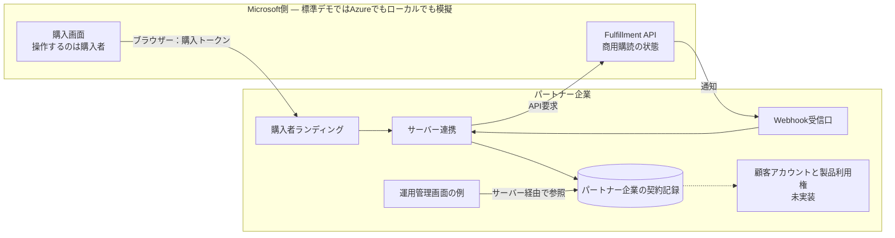

# デモの実装ガイド

**購入体験の裏側で何が起き、パートナー企業は何を実装するのでしょうか。**
この文書はデモとコードをつなぎます。前半はAPIの知識なしで読め、実装の詳細は後半にあります。
購入を完了する前に読む必要はありません。

> English: **[walkthrough.md](walkthrough.md)**
>
> 説明ではなく環境が必要な方は[デモの準備](run-demo.ja.md)へ。
> 動作中のデモから来た方は、元のタブで体験を続けてください。このガイドは購入トークンを受け取らず、
> 購入済みランディングを再作成するものではありません。

## このデモで分かること

購入者はサービスを選んで模擬購入し、パートナー企業のサイトで明示的に有効化します。
**有効化の結果で購入者の体験は完結**します。保存記録や通知テストは任意の確認で、
購入者が必ず続ける操作ではありません。

これは学習用サンプルで、SaaS製品の完成品ではありません。標準の**ローカルデモもAzureデモも
エミュレーターを使います**。実行場所と、連携相手がエミュレーターか実Marketplaceかは別の軸です。
実購入・実決済はありませんが、Azureホスティング費用は発生し得ます。
3つの模擬経路（`web-card`、`web-azure`、`azure-portal`）は実際の購入権限を検証せず、
すべての実オファーで各経路が使えることも保証しません。

パートナー企業の実アカウントへの紐付けと製品の利用制御は未実装です。
Activateの成功は、顧客が実製品を利用できることの証明ではありません。

## 操作の裏側で何が起きたか

| 購入者の操作 | サンプル内の動作 | 本番側を実装する主体 |
| --- | --- | --- |
| アプリ `/` の **購入体験を始める →** | エミュレーターの `/start.html` を開き、プラン選択から `/checkout.html` へ進む | 実際の購入画面はMicrosoft。エミュレーターは代役 |
| 注文内容を確認し、模擬注文する | タブごとの購入情報を保持。実注文・実決済は送信しない | Microsoftの購入体験 |
| **パートナー企業のサイトで設定する** | パートナーの `GET /?token=<purchase-token>` を開き、サーバーがResolveを呼ぶ | パートナー企業 |
| プランを確認して **サブスクリプションを有効化** | フォームのPOSTでActivateを呼び、その後パートナー側の結果を保存する | パートナー企業 |
| 有効化の結果を確認 | 購入者の体験が完了。保存状態の確認は任意 | パートナー企業 |

上記トークン表記はプレースホルダで、動作するショートカットではありません。
模擬購入で生成された設定リンクを使ってください。経路のラベルは購入証明ではありません。
エミュレーターの購読レコードは注文確認時ではなく、**Resolve時**に作られます。
同じタブの設定リンクを再利用すると、同じ模擬購入が使われます。

有効化済みの購入として戻った場合は **有効化済み。** と表示され、
GETで再有効化はしません。別に表示するパートナー側の記録は異なる場合があり、
画面は外部応答に合わせて保存状態を捏造しません。

## 誰が何を作るのか

**実装を提供する主体**と、**画面を操作する人**を区別します。

| 領域 | 操作する人 | 責任 |
| --- | --- | --- |
| Microsoftの購入領域（紺色の模擬画面） | 購入者 | Microsoftが本番の購入画面と商用購読サービスを提供。パートナー企業はMicrosoftの決済画面を実装しない |
| パートナー企業のサイト（青緑・白） | 購入者 | パートナー企業が購入後のランディングとサーバー連携を実装 |
| パートナー企業の管理領域（チャコール） | パートナー企業の運用担当者 | パートナー企業の契約記録を確認。この管理画面そのものは必須ではない |

```mermaid
flowchart LR
    subgraph MS["Microsoft側 — 標準デモではAzureでもローカルでも模擬"]
        BUY["購入画面<br/>操作するのは購入者"]
        API["Fulfillment API<br/>商用購読の状態"]
    end
    subgraph PARTNER["パートナー企業"]
        LAND["購入者ランディング"]
        SERVER["サーバー連携"]
        HOOK["Webhook受信口"]
        DB[("パートナー企業の契約記録")]
        ADMIN["運用管理画面の例"]
        PRODUCT["顧客アカウントと製品利用権<br/>未実装"]
    end
    BUY -->|"ブラウザー：購入トークン"| LAND
    LAND --> SERVER
    SERVER -->|"API要求"| API
    API -->|"通知"| HOOK
    HOOK --> SERVER
    SERVER --> DB
    ADMIN -->|"サーバー経由で参照"| DB
    DB -.-> PRODUCT
```

Microsoftの商用状態、パートナー企業の記録、製品へのアクセスは別のものです。
デモではエミュレーターのテーブルがMicrosoftの代役になりますが、
パートナー企業の画面はそれではなくパートナー企業のDBを読みます。
エミュレーターのHTTP応答や画面の見た目だけで、パートナー側への保存完了とは判断できません。

契約を**パートナー企業が管理する既存ユーザー／顧客企業ID**にどう結び付けるかは、
パートナー企業が設計します。パートナー企業自身のIDを顧客IDとする意味ではなく、
メールドメインが同じことだけを利用許可のルールにするものでもありません。

任意の全体図や説明用の役割リンクは、認証や権限付与ではありません。
運用には、この管理画面の代わりに既存の管理機能を使うこともできます。

## 任意：同じ契約の保存記録を確認する

1. 結果の後に **提供元の裏側を見る**、**この契約の保存記録を見る →** を開きます。
   `/admin/{guid}` のGUIDはパートナー側の保存レコードを識別し、Marketplace IDとは別です。
2. **この契約の変更を試す ↗** を選びます。エミュレーターの
   `/subscriptions.html?subscriptionId=<marketplace-id>` で同じ購読が選ばれます。
3. 対応する変更を試したら、同じ記録の `#history` に戻って再読み込みし、
   実際に保存された内容を確認します。配信と保存は非同期です。

パートナー側の一覧 `/admin?marketplaceSubscriptionId=<marketplace-id>` は完全一致で絞り込みます。
未知のIDならレコードなしとなり、別の契約で代用しません。エミュレーターの **すべての契約を表示** は選択を
明示的に解除します。エミュレーター側でも未知の選択はエラーを示し、別の契約を勝手に選びません。

履歴は記録されたプランを比較します。以前のプランの証拠がなければ **記録なし** であり、
現在の値から推測しません。期待する状態、通知操作、HTTP応答と保存結果の違いは
[連携の検証](l2-demo.ja.md#manual-checks)を参照してください。

エミュレーターの `/` は従来の購入トークンツール、`/landing.html` は内蔵APIテストページです。
どちらもパートナー企業の本番ランディングではありません。
オファー・設定・通知は運用担当者用のツールで、Partner Centerや購入者向け製品タブではありません。
[エミュレーターのガイド](../emulator/README.md)を参照してください。

画面の参照：[購入](images/screenshots/boundary-ja-purchase.png)、
[引き渡し](images/screenshots/boundary-ja-handoff.png)、
[パートナー側ランディング](images/screenshots/boundary-ja-landing.png)、
[結果](images/screenshots/experience-ja-result.png)、
[保存記録](images/screenshots/boundary-ja-admin.png)。
[撮影条件](develop.ja.md#screenshots-and-evidence)は別に記録しています。

## コードで確かめる

| 動作 | コード |
| --- | --- |
| トークン受け取り、有効化済みの再訪、明示POST | [Indexページモデル](../src/SaaSAgentSample.Web/Pages/Index.cshtml.cs)と[Razorページ](../src/SaaSAgentSample.Web/Pages/Index.cshtml) |
| Resolve、Activate、パートナー側の結果保存 | [LandingService](../src/SaaSAgentSample.Web/Services/LandingService.cs) |
| 外向きのAPI要求 | [FulfillmentClient](../src/SaaSAgentSample.Fulfillment/FulfillmentClient.cs) |
| 通知受信・検証、状態変更、応答 | [WebhookEndpoint](../src/SaaSAgentSample.Web/Endpoints/WebhookEndpoint.cs)、[WebhookService](../src/SaaSAgentSample.Web/Services/WebhookService.cs) |
| 状態遷移の保護 | [Subscription](../src/SaaSAgentSample.Core/Subscriptions/Subscription.cs) |
| 契約とイベント履歴の保存 | [Repository](../src/SaaSAgentSample.Data/Persistence/EfSubscriptionRepository.cs)、[イベントログ](../src/SaaSAgentSample.Data/Persistence/EfSubscriptionEventLog.cs) |

### 用語と呼び出しの向き

| 用語 | この文書での意味 |
| --- | --- |
| 購入トークン | Resolveで交換する不透明な購入識別情報。サインイントークンや顧客アカウントIDではない |
| Resolve / Activate | 購入情報の取得／明示的な有効化を報告するパートナーサーバーからの呼び出し |
| APIアクセストークン | サービス間の認可情報。実トークンを取得するproviderは未実装 |
| Webhook | パートナーサーバーに届く通知。検証してから適用する |
| 契約ストア | パートナー側の記録。課金やアクセス全体を支配する唯一の正本ではない |
| 利用権 | 顧客IDと契約に結び付く製品の利用制御。ここでは未実装 |

API要求は **パートナーサーバー → Microsoft（デモではエミュレーター）**、
通知はその逆向きです。ブラウザーのトークン引き渡しは別の通信です。
購入者のサインイン、APIの認可、Webhookの検証は目的が異なります。
サンプルにはEntraサインインを有効にする設定がありますが、
顧客と契約の対応に基づく認可まで完成している証拠ではありません。

### 保存状態と通知

ドメインには `PendingFulfillmentStart`、`Subscribed`、`Suspended`、`Unsubscribed` の状態があります。
明示的な有効化と受理したライフサイクル通知によって記録を更新します。
プラン変更は有効状態を保ち、数量変更は記録・応答しますが、パートナー側ドメインに数量項目はありません。
Renewはこの実装では情報通知です。[期待する結果とテスト範囲](l2-demo.ja.md)を参照してください。

## サービスに組み込むときに追加すること

| 領域 | 実装済み | 追加する作業 |
| --- | --- | --- |
| 実APIの認証 | 差し替え可能な `IMarketplaceTokenProvider`。既定の[DevNull provider](../src/SaaSAgentSample.Fulfillment/DevNullMarketplaceTokenProvider.cs)はトークンを返さない | 実際のサービス間トークン取得と登録。BaseUrl変更だけでは不足 |
| 顧客アカウントと製品アクセス | オファー・プラン・契約状態の保存 | 既存顧客IDとの対応、製品の準備、認可、利用制御を設計・実装 |
| 購入者・運用担当者のサインイン | 任意のEntra設定。標準デモは無効 | IDとサービス固有の権限の設定・検証。ナビゲーションは認可ではない |
| Webhook検証 | JWT検証とGet Operationによる照合 | 標準デモは署名検証を緩和。実連携は公式の検証条件に合わせた設定・テストが必要 |
| 障害復旧 | API呼び出し、DB保存、イベント記録 | 外部呼び出し・保存・応答の間の失敗を検討し、監視と復旧を設計 |
| 製品・価格モデル | 定額フルフィルメントの例と説明用の容量表示 | 実計量、ユーザー数に基づく利用制御、自動有効化は未実装 |

`LandingService`はActivate呼び出し後に保存し、`WebhookService`は保存後にプラン・数量操作へ応答します。
こうしたシステム間の境界は導入時の確認事項です。この表は実装検討の入口であり、
本番化の網羅的なチェックリストではありません。

ブラウザーでの購入連携を学ぶために既存のデスクトップクライアントを置き換える必要はありません。
アカウントや利用制御との連携は、引き続き製品固有の設計になります。

環境準備は[run-demo](run-demo.ja.md)、開発は[develop](develop.ja.md)、
自動テストと手動確認は[連携の検証](l2-demo.ja.md)へ進んでください。

実オファーの設定と従来集めた購入ポリシーの参考リンクは、
[実Marketplace接続の参考](deploy.ja.md#marketplace-reference)にまとめています。
デモ完了の前提条件でも、3つの模擬購入経路が実際に検証する内容でもありません。

## 公式参考資料

2026-09-12に取得確認。連携の契約を説明する資料であり、サンプルが全フローを実装している、
または実オファー検証に合格したという意味ではありません。

- [SaaS fulfillment APIs](https://learn.microsoft.com/en-us/partner-center/marketplace-offers/pc-saas-fulfillment-apis)
- [Technical configuration](https://learn.microsoft.com/en-us/partner-center/marketplace-offers/create-new-saas-offer-technical)
- [サービス登録とAPIアクセストークン](https://learn.microsoft.com/en-us/partner-center/marketplace-offers/pc-saas-registration)
- [Webhook処理と検証](https://learn.microsoft.com/en-us/partner-center/marketplace-offers/pc-saas-fulfillment-webhook)
