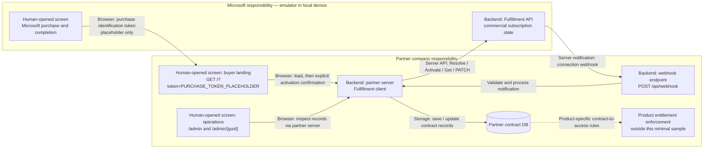
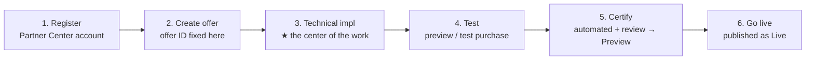
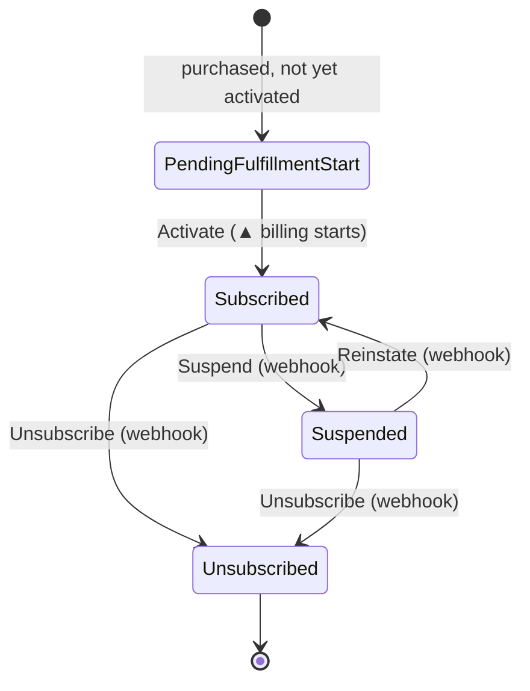
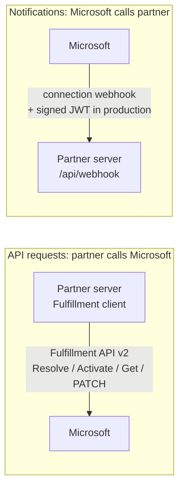

# Experience walkthrough: buyer & partner company

A plain-language map of **who does what** when a SaaS Offer is sold and operated on the Microsoft
Commercial Marketplace — and how each piece maps to **this sample's** code. Try the purchase first;
use the explanations when you want to understand *why* each part exists. It is a teaching aid,
not a substitute for the official docs (linked at the end).

> 🌐 日本語版: **[walkthrough.ja.md](walkthrough.ja.md)**

Start at the app's `/`: one short sentence and **Start the purchase experience →**, with no mandatory role or
interest selection. Follow the [buyer journey](#buyer-handoff-and-operator-inspection--the-local-browser-journey)
to the activation result. That is sufficient for a business/sales or buyer demonstration;
implementation and operations depth is optional.

The demo is for operations and observed results; this document is for **what happened → who
implements it → code**. The small **Implementation guide ↗** footer link opens this repository
document in the current UI language, without forwarding purchase tokens or query values.
**View the whole flow** remains initially closed in `<details id="boundary">`. Saved records and
change history remain in the demo. The in-app lesson and interest selector have been removed;
older `#how` links now point at the guide link, not an automatic external redirect.

One common small **Demo** disclosure per page explains that these are simulated purchases with no real
payment; **Azure hosting may still incur costs**. Order confirmation retains the precise note
that no real order or payment is created.

<details>
<summary>Reference: terminology</summary>

> **Quick glossary** — terms used in this document:
> - **v0**: the initial version of this sample (all components run locally).
> - **Tier-1 flat-rate**: a single fixed monthly price per subscription (no metered or per-user billing).
> - **L2 walkthrough**: an integration-level end-to-end proof — the app exercises the subscription lifecycle over real HTTP against a simulated Fulfillment API.
> - **Synthetic L2**: the automated in-repo variant where an HTTP stub replaces the Docker emulator (no Docker needed).
> - **L3**: a live end-to-end test with a real marketplace purchase and real buyer account (out of scope for this sample).

</details>

---

## The three actors

| Actor | Metaphor | Role |
| --- | --- | --- |
| **Microsoft** | the **shop** | Provides the production marketplace purchase screens and Fulfillment API, manages commercial subscription state and customer billing, and sends subscription notifications. The local emulator only simulates this side. |
| **Partner company (SaaS publisher)** | the **manufacturer** | Lists the SaaS Offer and implements its buyer landing, server-side Fulfillment calls, webhook endpoint, and contract DB. Also owns product entitlements and account mapping, which this minimal sample does not implement. **Does not implement Microsoft's checkout.** |
| **Buyer** | the **customer** | Operates Microsoft's purchase screens, then the partner's buyer site to configure the purchase. Usually belongs to a **different tenant** than the partner. Is not the partner's operations staff. |

> Because the buyer is in a **different tenant**, landing-page sign-in must be **multitenant** (each
> buyer tenant consents). In this sample that is the `AzureAd` (authority `common`) landing app,
> which is **separate** from the service app that calls the fulfillment APIs. Buyer sign-in is
> disabled in the local demo. The new screen labels do not change this authentication behavior.

---

## Responsibility boundary — screens, servers, and storage

The different Microsoft and partner headers describe who provides each area and who operates it;
they are not a shared product navigation. The whole-flow diagram and explanations remain optional:

| Area | Human operator | Visual boundary / implementation |
| --- | --- | --- |
| Microsoft simulated storefront | Buyer | Navy purchase header. Microsoft provides the real production checkout; the partner does not build it. |
| **Partner company site / For buyers** | Buyer | Teal/white header; **Partner implementation starts here** at the post-purchase landing. |
| **Partner company administration / For operators** | Partner operations staff | Charcoal header/sidebar, separate from buyer navigation. Inspects saved partner contracts. |

There is no required role-switch step or same-privilege Home/Admin navigation. After the result,
**See behind the partner site / 提供元の裏側を見る** optionally reveals the actual stored partner
state and a direct link to this contract's operations detail.

Suggested reading by interest is below, not a selector or gate in the app. A person's job and the
role they play in the demo are different. Links do not authenticate or grant permissions.
Server APIs, authentication, billing, lifecycle state and DB schema are unchanged.

| Interest | What to follow |
| --- | --- |
| Business and sales | What is bought, the handoff to the partner, and the activation result |
| Buying organization | Purchase permissions, account setup and confirmation |
| Implementation | Server calls, webhook validation, account mapping and the code references below |
| Operations | Open the saved contract, make one change and inspect persisted plan/state/history |

**Example operations UI implemented by the partner company** names the implementation owner,
not a mandatory screen design. Contract recording and synchronization belong to the partner;
the management UI is optional and can reuse existing tools.



The purchase identification token is not a buyer sign-in token and is not the customer's
partner-side account ID. The intended integration maps the resolved purchase to **existing
user/customer-company IDs managed by the partner company**; this sample does not perform that
real mapping or enforce product access. A successful Activate is not evidence of implemented
product entitlements.

The partner UI reads partner DB records only. Microsoft's commercial state (simulated by a
separate emulator table locally), the partner contract DB, and product access are distinct
responsibilities — there is no universal "DB is the billing source of truth" claim.

---

## Buyer handoff and operator inspection — the local browser journey

Start at the **app `/`**, select **Start the purchase experience →**, and continue to the emulator
**`/start.html`**, not the legacy root token form. You do not need to open the whole-flow diagram
or choose an interest before starting.

1. **Microsoft simulation, operated by the buyer:** choose an offer/plan at `/start.html`, then
   open `/checkout.html`. `web-card`, `web-azure`, and `azure-portal` illustrate different
   purchase routes, not guaranteed availability for every real offer. No real payment,
   card collection, Azure purchase, or resource creation occurs.
   All three routes and the purchase-token handoff are unchanged by this presentation update.
2. **Boundary handoff:** simulated completion identifies the partner site as the next destination.
   **Continue on the partner site** opens `GET /?token=<purchase-token>` in the browser. The value
   here is a placeholder only. Configuration alone, scenario metadata, or a token-free link
   cannot create a valid purchased landing.
3. **Partner buyer site:** the server exchanges the token through **Resolve** to obtain
   subscription details; it does not locally "decode" a real Marketplace token. The buyer
   reviews the result and explicitly confirms **Activate**. In the emulator, the simulated
   subscription record is created at Resolve, not by a real purchase at checkout.
4. **Result:** activation completes the buyer walkthrough. You can stop here; opening an admin
   console is not a required next action. This confirms the sample's activation flow, not
   implemented product entitlements or real customer-account mapping.

The reference map also shows partner contract storage and notification tests, but these are not
mandatory buyer steps. A valid purchased landing still requires the synthetic purchase handoff
with its token; the reference is not a shortcut around purchase.

### Optional: follow this same contract behind the partner site

For implementation or operations exploration, continue from the result:

1. Open **See behind the partner site** to see the actual partner state saved for this purchase.
   Follow its direct **`/admin/{guid}`** link: the GUID belongs to the saved partner record, not
   the Marketplace subscription ID. Missing records do not produce fabricated detail links.
2. If opening the list with **`/admin?marketplaceSubscriptionId=<actual-id>`**, the filter matches
   that exact saved Marketplace subscription ID. An unknown ID explicitly shows no matching records,
   not the full list, a partial match, or a different contract. These views read the partner DB,
   not the emulator's subscription table. The emulator's partner-record links use this path on the
   configured partner origin, with the selected subscription's actual ID.
3. On the detail page, choose **Try a change for this contract**. It opens the emulator's
   **`/subscriptions.html?subscriptionId=<actual-marketplace-id>`** with that same subscription
   selected. Try **Change plan**, **Suspend**, **Reinstate**, or **Unsubscribe** there; the
   notification tool is not a buyer storefront tab. **Show all** explicitly clears that emulator
   selection while preserving demo context; an unmatched ID does not silently select another contract.
4. Return to the same partner detail and reload **`/admin/{guid}#history`**. Inspect the real saved
   events and recorded plan comparison. The previous plan comes from the latest earlier saved
   event containing a plan; events without a plan do not provide one. Without an earlier recorded
   plan, the UI says **Not recorded** — it never derives the previous value from the current plan.

The URL values above are placeholders; use the UI's links containing the actual saved IDs.
Delivery and storage are asynchronous. Check what is recorded after reloading; do not infer that
the systems are "in sync" or an absent update is "pending" without evidence. None of these
inspection links changes role permissions or implements product access.

### Technical tools are not the product experience

- Emulator **`/`** is the legacy token-generation form.
- Emulator **`/landing.html`** is an API test page, not a Microsoft-provided landing or the
  partner's product UI.
- Emulator **`/subscriptions.html`** is a demo operator event tool, not a storefront tab for
  customers.
- Optional references and behind-the-scenes links connect the demonstration, not production privileges.

### Screenshots from the running local sample

These show the real UI and partner app with local synthetic data and an isolated HTTP fixture
for emulator APIs, not real purchases or design-approval mockups. Targeted Node checks passed for
this preview: journey (37), experience (14), checkout (18), and subscription selection (10).
These checks are not the full Jest suite. The full Node emulator and Jest
suite were not validated: the configured npm feed returned 404 for required dependencies and the
local Docker engine was unavailable. Browser checks with the fixture do not replace full-emulator
integration validation. The whole-flow diagram is optional and initially closed; these images
do not require every reference to be expanded.

| Responsibility area | Screenshot |
| --- | --- |
| Start: one sentence and purchase action | [Start page](images/screenshots/experience-en-home.png) |
| Microsoft simulated purchase | [Purchase screen](images/screenshots/boundary-en-purchase.png) |
| Completion; whole-flow reference is optional | [Partner-site handoff](images/screenshots/boundary-en-handoff.png) |
| Partner buyer site | [Purchased landing](images/screenshots/boundary-en-landing.png) |
| Buyer walkthrough complete; deeper inspection is optional | [Activation result](images/screenshots/experience-en-result.png) |
| Optional partner operations | [Saved contract records](images/screenshots/boundary-en-admin.png) |

### Automated test versus manual browser setup

```bash
dotnet test --filter FullyQualifiedName~SyntheticL2LifecycleTests
```

This existing test runs a **Docker-free HTTP fixture** with the app; it needs the .NET 10 SDK,
not a separately running full emulator. It does **not** leave a storefront running for
manual browser use. For that, run the app and the vendored Node emulator separately, with its
Node/npm dependencies installed and built, or use Docker. Configure the Fulfillment base URL,
landing URL, and webhook URL for the selected ports. See the [local quickstart](../README.md#run-locally)
and [L2 setup reference](l2-demo.md); the latter's technical token-form exercise is separate
from the recommended `/start.html` buyer flow above.

The emulator comes from vendored commit `bb7bc6317128605b2f777ebe1c9969198733ae85` with local
teaching changes, not an upstream runtime fetch. Provenance: [emulator/NOTICE.md](../emulator/NOTICE.md).

---

## Partner company journey — six phases to go live



Phase 3 is where this sample lives. Phases 1–2 and 5–6 are Partner Center portal steps; phase 4 is
where the partner tests the integration. This sample exercises the flow **without a real
purchase** using the [Fulfillment API Emulator](l2-demo.md); that does not replace the
production offer's preview and validation process.

> The offer ID/alias is **fixed at Create and cannot be changed**; a Live offer can't be deleted,
> only taken out of distribution. (See *Create a SaaS offer*.)

---

## Technical configuration — the four connection points

In the offer's **Technical configuration**, four fields wire the marketplace to the partner's
implementation. Here is how each maps to this sample:

| Partner Center field | What it is | In this sample |
| --- | --- | --- |
| **Landing page URL** | Partner page the buyer opens after purchase (Resolve → Activate). Must run 24×7. | `GET /?token=<purchase-token>`; without a token, `/` is the purchase start page |
| **Connection webhook** | Endpoint Microsoft POSTs subscription changes to. Must run 24×7. | `POST /api/webhook` |
| **Microsoft Entra tenant ID** | Tenant of the **service app** that calls Fulfillment API v2. | `AzureAd`/token config (placeholder) |
| **Microsoft Entra application ID** | The **service app** whose credentials call Fulfillment API v2. | Fulfillment client auth (placeholder) |

> The **service app** (calls the fulfillment APIs) is different from the **landing app** (multitenant,
> for buyer sign-in). Only the service app's tenant/app IDs go in this screen.

---

## Subscription lifecycle — the state story

Microsoft manages the commercial subscription lifecycle; the partner reacts to each transition.
This sample's partner contract store models the **four official states**:



- The **front half** (activation) is driven by the **landing page**: Resolve → explicit-confirm Activate.
- The **back half** (change / suspend / reinstate / unsubscribe) is driven by the **connection webhook**.
- An **auto-activated** purchase skips the first state and starts at `Subscribed`.
- `ChangePlan` / `ChangeQuantity` stay within `Subscribed`. Plan changes are tracked;
  `ChangeQuantity` is recorded and acknowledged, but the partner domain has **no quantity
  dimension**. This sample implements **Tier-1 flat-rate**, not per-unit billing.

The aggregate **guards these transitions** (invalid ones are rejected). The partner console
reports saved records, not a live cross-system synchronization verdict. Asynchronous webhook
delivery/storage and the emulator's separate table must be considered when comparing screens.
Product-specific entitlement changes following these states are outside the sample.

---

## Call direction & the "passes" exchanged

For the **backend integration**, Fulfillment calls go **partner server → Microsoft**;
webhook notifications go **Microsoft → partner server**. The buyer's browser handoff is a
different kind of traffic, shown separately in the responsibility diagram above.



The "passes" that travel through the flow (the metaphor that makes it stick):

| Pass | Metaphor | Purpose | In this sample |
| --- | --- | --- | --- |
| **Purchase token** | ticket stub | Redeemed at **Resolve** for the subscription details | `x-ms-marketplace-token` on Resolve |
| **`id_token`** | name badge | Buyer sign-in = **authentication** | landing multitenant sign-in |
| **Access token** | vendor pass | Service app's **authorization** to call Fulfillment API v2 | bearer token on API calls |
| **Signed JWT** | Microsoft's name badge | Attached to **webhook** calls; proves the caller | validated server-side |

> **Webhook validation is server-side**: this sample validates the
> Entra JWT (signature/issuer/audience + `appid`/`azp`, where `20e940b3-4c07-4bc1-a733-45f7c7a3d0e3`
> is the **public** Marketplace app id — a documented constant, not a secret), and then authorizes
> the payload against the Microsoft operation via **Get Operation** before changing state.
> Local demo configuration relaxes signed-token validation for the emulator; that is not
> production webhook authentication.

---

## Implementation reference

These notes replace the former in-app lessons. They explain the sample, rather than report
live purchase authorization or a successful production setup.

### Terms used in the code

| Term | Meaning |
| --- | --- |
| Landing page | Partner page opened after purchase with a purchase identification token |
| Resolve | Server call exchanging that opaque token for subscription, offer, plan and buyer details |
| Activate | Manual-activation flow's signal that provisioning is complete; successful activation starts billing |
| Webhook | Asynchronous notification of changes; the partner validates it before updating saved state |
| State store | The partner's persisted contract records, separate from Microsoft's commercial state |
| Entitlement | Product access rules the partner associates with customer identities and contracts; not implemented here |
| Change plan | Change on the same subscription; Microsoft manages the commercial pricing side |
| Dimension | Metered billing unit; this flat-rate sample has no implemented metering dimension |
| Prepaid capacity | An illustrative allowance display only, not actual metering or a new billing model |
| Fulfillment layer | The landing, API calls, webhook and saved contracts, not the SaaS product itself |

The existing Windows/desktop client need not be rewritten as a website. The partner can use
a browser for purchase/setup and keep the existing client and service backend. The partner
owns the mapping to its **existing user/customer-company IDs**; a shared email domain alone
must not grant every employee access. The demo does not perform this real mapping.

The landing can receive a new purchase or a returning active purchase. The sample checks the
returned status; it does not activate an already active purchase again on a GET. The same
browser-tab Configure link reuses its synthetic purchase. The emulator creates a subscription
on Resolve, not at the simulated order-confirmation screen. Automatic activation is a different
flow and is not implemented by this manual-activation sample.

### Purchase routes and permissions

These are the previously documented reference distinctions, **not checks performed by the demo**.
Verify the current official requirements before using them with a real offer or tenant.

| Route / action | Relevant distinction | Customer-side control |
| --- | --- | --- |
| Web card purchase | Work/school account and card; a universal preassigned Entra admin role is not stated in the referenced Web purchase prerequisites | Third-party SaaS self-service purchasing policy and sign-in restrictions |
| Existing MCA company billing profile | Permission to purchase against that profile, such as profile Contributor/Owner; not a blanket prerequisite for every first card purchase | Microsoft 365 admin center billing-profile roles |
| Azure checkout, whether entered from Web or portal | An eligible Azure subscription and sufficient purchase permissions; read access alone is not enough | Azure RBAC, Marketplace purchase controls, Private Marketplace |
| Partner landing after purchase | Entra sign-in/consent and intended customer-account mapping | Customer sign-in policies and partner product access rules |

`AllowSelfServicePurchase / OfferType SaaS` is an offer-type policy, not a per-partner allowlist,
and does not block Azure portal purchases. MCA billing-profile permissions are not MOSA billing
administrator roles. Partners cannot override customer purchasing restrictions.

Reference links moved from the UI (not freshly reverified in this documentation move):

- [Web acquisition requirements](https://learn.microsoft.com/en-us/marketplace/purchase-software-appsource)
- [Third-party SaaS self-service policy](https://learn.microsoft.com/en-us/microsoft-365/commerce/subscriptions/allowselfservicepurchase-powershell?view=o365-worldwide#use-allowselfservicepurchase-with-third-party-offer-types)
- [MCA billing-profile roles](https://learn.microsoft.com/en-us/microsoft-365/commerce/billing-and-payments/manage-billing-profiles?view=o365-worldwide#assign-billing-profile-roles)
- [Azure checkout requirements](https://learn.microsoft.com/en-us/marketplace/purchase-saas-offer-in-azure-portal#requirements)
- [Private Marketplace](https://learn.microsoft.com/en-us/marketplace/create-manage-private-azure-marketplace-new)
- [Landing sign-in and return visits](https://learn.microsoft.com/en-us/partner-center/marketplace-offers/azure-ad-transactable-saas-landing-page)
- [Partner Center preview](https://learn.microsoft.com/en-us/partner-center/marketplace-offers/review-publish-offer#publisher-sign-off-phase)

### Relevant code and tool behavior

- [LandingService.cs](../src/SaaSAgentSample.Web/Services/LandingService.cs): Resolve, explicit Activate, saved contract.
- [WebhookService.cs](../src/SaaSAgentSample.Web/Services/WebhookService.cs): operation validation, state updates and acknowledgement.
- [EfSubscriptionRepository.cs](../src/SaaSAgentSample.Data/Persistence/EfSubscriptionRepository.cs): persisted partner records.
- [Emulator guide](../emulator/README.md): catalogue editing, legacy token form, embedded API-test landing and event tools.

In the event tool, Detail/State button colors describe the type of change, not the implementation
owner or a delivery guarantee. A Renew response may leave the state unchanged. The partner's
saved event trail is the place to inspect what was received and stored. Missing prior plan records
remain unknown in before/after comparisons. Neither a catalogue edit nor an emulator HTTP response
proves that partner-side storage has changed.

## How the pieces map to this sample (v0 scope)

| Concept | This sample |
| --- | --- |
| Partner buyer landing (Resolve → explicit Activate) | `src/SaaSAgentSample.Web` — `GET /?token=<purchase-token>`, `LandingService` |
| Connection webhook (2-stage server-side) | `POST /api/webhook`, `WebhookService` + `IWebhookTokenValidator` |
| Saved partner contract state (4 states) | `SaaSAgentSample.Core` aggregate + `SaaSAgentSample.Data` store |
| Optional same-contract operations (inspect + explicit Activate) | `/admin?marketplaceSubscriptionId=<actual-id>`, `/admin/{guid}`, and `#history`; saved partner records, not buyer navigation |
| Reference explanations | This walkthrough; the demo's implementation-guide link opens the matching language, while its whole-flow figure remains available |
| Product entitlement enforcement / real account mapping | Not implemented by this minimal sample |
| Test without a real purchase | [L2 walkthrough](l2-demo.md) via the emulator — **L2** = integration-level end-to-end proof over HTTP |

**In v0 scope (initial local-only version):** Tier-1 **flat-rate** only (single fixed price).
**Out of scope in v0:** metered billing / per-user quantity / product-specific entitlement
enforcement / real account mapping / real marketplace purchase (L3 — live end-to-end with a
real buyer account). See the
[README](../README.md) for run and config, and [docs/deploy.md](deploy.md) for a
human-authorized Azure deployment.

---

## Sources (existing Microsoft Learn references)

These links and prior check dates are retained from the existing documentation. They were
**not reverified for this revision**; no new live-source verification is claimed.

Previously recorded check: 2026-07-21:

- Create a SaaS offer: <https://learn.microsoft.com/en-us/partner-center/marketplace-offers/create-new-saas-offer>
- Add technical details for a SaaS offer: <https://learn.microsoft.com/en-us/partner-center/marketplace-offers/create-new-saas-offer-technical>
- Review and publish an offer: <https://learn.microsoft.com/en-us/partner-center/marketplace-offers/review-publish-offer>

Previously recorded check: 2026-07-18:

- SaaS fulfillment APIs: <https://learn.microsoft.com/en-us/partner-center/marketplace-offers/pc-saas-fulfillment-apis>
- SaaS subscription life cycle: <https://learn.microsoft.com/en-us/partner-center/marketplace-offers/pc-saas-fulfillment-life-cycle>
- Implementing a webhook: <https://learn.microsoft.com/en-us/partner-center/marketplace-offers/pc-saas-fulfillment-webhook>
- Register a SaaS application: <https://learn.microsoft.com/en-us/partner-center/marketplace-offers/pc-saas-registration>
