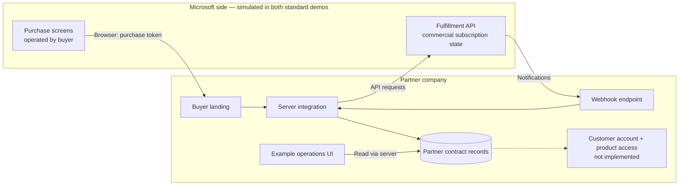

# Demo implementation guide

**What happened during the purchase, and what does the partner company implement?**
This guide connects the demo to its code. You can read the first sections without API knowledge;
implementation details follow later. You do not need to read it before completing the purchase.

> 日本語: **[walkthrough.ja.md](walkthrough.ja.md)**
>
> Need an environment rather than an explanation? [Prepare the demo](run-demo.md).
> If you arrived from a running demo, return to its existing tab to continue; this guide does
> not receive your purchase token or recreate the purchased landing.

## What this demo shows

The buyer chooses a service, makes a simulated purchase, continues on the partner site, and
explicitly activates it. **The activation result completes the buyer experience.**
Saved records and notification tests are optional investigation, not further buyer obligations.

This is a learning sample, not a complete SaaS product. The standard **local and Azure demos
both use the emulator**. Hosting location is independent of whether the integration partner
is an emulator or the real Marketplace. There is no real purchase/payment; Azure hosting may
still incur costs. The three illustrated routes (`web-card`, `web-azure`, `azure-portal`) do
not verify real purchase permissions or guarantee that every real offer supports each route.

The partner's account linking and product access control are not implemented. A successful
Activate is not proof that a customer can use a real product.

## What happened behind the screens

| What the buyer does | What happens in this sample | Who implements the production side |
| --- | --- | --- |
| **Start the purchase experience →** at the app's `/` | Opens emulator `/start.html`; choosing a plan leads to `/checkout.html` | Microsoft provides real purchase screens; the emulator is only a stand-in |
| Review and place the simulated order | Keeps a per-tab purchase snapshot; no real order/payment is submitted | Microsoft's purchase experience |
| **Continue on the partner site** | Opens partner `GET /?token=<purchase-token>`; its server calls Resolve | Partner company |
| Review the plan and choose **Activate subscription** | Form POST invokes Activate and then saves the partner result | Partner company |
| Read the activation result | Buyer experience is complete; saved-state inspection is optional | Partner company |

The token above is a placeholder, not a working shortcut. Use the Configure/continuation link
from the simulated purchase. Scenario labels are not proof of purchase.
The emulator creates its subscription record at **Resolve**, not at order confirmation.
Reusing the same tab's continuation link reuses that synthetic purchase.

A returning purchase already reported as active is labelled **Already active.** The page does
not activate it again on GET. The separately displayed partner record may differ; the UI does
not invent a saved state to match the remote response.

## Who builds what

Distinguish the **provider of an implementation** from the **person operating a screen**.

| Area | Operated by | Responsibility |
| --- | --- | --- |
| Microsoft purchase area (navy simulation) | Buyer | Microsoft provides real checkout and commercial subscription services; the partner does not implement Microsoft's checkout |
| Partner site (teal/white) | Buyer | Partner implements the post-purchase landing and server-side integration |
| Partner administration (charcoal) | Partner operations staff | Partner inspects its own contract records; this exact management UI is optional |

```mermaid
flowchart LR
    subgraph MS["Microsoft side — simulated in both standard demos"]
        BUY["Purchase screens<br/>operated by buyer"]
        API["Fulfillment API<br/>commercial subscription state"]
    end
    subgraph PARTNER["Partner company"]
        LAND["Buyer landing"]
        SERVER["Server integration"]
        HOOK["Webhook endpoint"]
        DB[("Partner contract records")]
        ADMIN["Example operations UI"]
        PRODUCT["Customer account + product access<br/>not implemented"]
    end
    BUY -->|"Browser: purchase token"| LAND
    LAND --> SERVER
    SERVER -->|"API requests"| API
    API -->|"Notifications"| HOOK
    HOOK --> SERVER
    SERVER --> DB
    ADMIN -->|"Read via server"| DB
    DB -.-> PRODUCT
```

Microsoft's commercial state, the partner's records, and access to the product are separate.
In a demo the emulator's table stands in for Microsoft; the partner UI reads the partner DB,
not that table. Neither an emulator HTTP response nor a matching-looking screen proves that
the partner DB has been updated.

The partner must design how a contract relates to **existing user/customer-company IDs
managed by the partner**. This does not mean the partner company's own ID is a customer's ID,
and a shared email domain alone is not an access-control rule.

The optional whole-flow diagram and teaching-role links do not authenticate anyone or grant
permissions. The management UI may be replaced with existing operations tools.

## Optional: inspect the same contract

1. After the result, open **See behind the partner site** and **View this saved contract →**.
   The `/admin/{guid}` link identifies the saved partner record, not the Marketplace ID.
2. Choose **Try a change for this contract ↗**. The emulator opens
   `/subscriptions.html?subscriptionId=<marketplace-id>` for the same subscription.
3. Try a supported change, then return to the same record's `#history` and reload.
   Inspect what was actually saved. Delivery and storage are asynchronous.

The filtered partner list `/admin?marketplaceSubscriptionId=<marketplace-id>` matches exactly;
an unknown ID shows no records, not a substitute contract. The emulator's **Show all subscriptions** explicitly
clears its selection. Unknown emulator selections report an error rather than silently choosing
another contract.

The history compares recorded plans. Missing prior plan evidence is **Not recorded**, not a
value inferred from the current plan. For expected states, notification actions, and the
difference between an API response and saved evidence, see [integration verification](l2-demo.md#manual-checks).

The emulator's `/` is the legacy purchase-token utility and `/landing.html` is an embedded API
test page. Neither is the partner's production landing. Offers/configuration and notifications
are operator tools, not Partner Center or buyer product tabs. See the [emulator guide](../emulator/README.md).

Screen references: [purchase](images/screenshots/boundary-en-purchase.png),
[handoff](images/screenshots/boundary-en-handoff.png),
[partner landing](images/screenshots/boundary-en-landing.png),
[result](images/screenshots/experience-en-result.png), and
[saved records](images/screenshots/boundary-en-admin.png).
[Capture conditions](develop.md#screenshots-and-evidence) are recorded separately.

## Find the implementation

| Behavior | Code |
| --- | --- |
| Token arrival, already-active return, explicit form POST | [Index page model](../src/SaaSAgentSample.Web/Pages/Index.cshtml.cs) and [Razor page](../src/SaaSAgentSample.Web/Pages/Index.cshtml) |
| Resolve, Activate, save partner result | [LandingService](../src/SaaSAgentSample.Web/Services/LandingService.cs) |
| Outbound API requests | [FulfillmentClient](../src/SaaSAgentSample.Fulfillment/FulfillmentClient.cs) |
| Receive and validate notification, change state, acknowledge | [WebhookEndpoint](../src/SaaSAgentSample.Web/Endpoints/WebhookEndpoint.cs), [WebhookService](../src/SaaSAgentSample.Web/Services/WebhookService.cs) |
| Guard state transitions | [Subscription](../src/SaaSAgentSample.Core/Subscriptions/Subscription.cs) |
| Save contracts and their event history | [Repository](../src/SaaSAgentSample.Data/Persistence/EfSubscriptionRepository.cs), [event log](../src/SaaSAgentSample.Data/Persistence/EfSubscriptionEventLog.cs) |

### Terms and call direction

| Term | Meaning here |
| --- | --- |
| Purchase token | Opaque purchase identifier exchanged via Resolve; not a sign-in token or customer account ID |
| Resolve / Activate | Partner server calls to retrieve purchase information / explicitly report activation |
| API access token | Service-to-service authorization; the real token provider is not implemented here |
| Webhook | Notification arriving at the partner server; validate before applying it |
| Contract store | Partner records, not a universal source of truth for billing or access |
| Entitlement | Product access associated with customer identities and contracts; not implemented here |

API requests travel **partner server → Microsoft (emulator in demos)**; notifications travel
the reverse direction. The browser's token handoff is a separate connection.
Buyer sign-in, API authorization, and webhook validation have different purposes. The sample
has an optional Entra sign-in configuration; do not treat that as proof of completed
customer-to-contract authorization.

### Saved state and notifications

The domain has `PendingFulfillmentStart`, `Subscribed`, `Suspended`, and `Unsubscribed`.
Explicit activation and accepted lifecycle notifications update these records. Plan changes
keep the subscription active; quantity changes are recorded/acknowledged but the partner
domain has no quantity field. Renew is informational in this implementation.
See [expected outcomes and test boundaries](l2-demo.md).

## What must be added for your service

| Area | Shipped here | Work still required |
| --- | --- | --- |
| Real API authentication | Replaceable `IMarketplaceTokenProvider`; default [DevNull provider](../src/SaaSAgentSample.Fulfillment/DevNullMarketplaceTokenProvider.cs) returns no token | Implement and register real service-to-service token acquisition; changing BaseUrl is not enough |
| Customer account and product access | Saved offer, plan and contract state | Design and implement mapping to existing customer IDs, provisioning, authorization and access changes |
| Buyer/operator sign-in | Optional Entra configuration, off in standard demos | Configure and test identities and service-specific permissions; navigation is not authorization |
| Webhook validation | JWT validator and Get Operation comparison | Standard demos relax signature validation; real integration needs the documented validation configuration and testing |
| Failure recovery | API calls, DB writes, saved events | Review failures between external calls, local commits and acknowledgements; design monitoring and recovery |
| Product/pricing model | Flat-rate fulfillment example and illustrative capacity display | No metering, per-user entitlement enforcement, or automatic activation implementation |

`LandingService` calls Activate before saving the partner result; `WebhookService` saves before
acknowledging a plan/quantity operation. These cross-system boundaries matter when adapting the
sample. This table is a starting point for implementation planning, not a complete production checklist.

An existing desktop client need not be replaced merely to study this browser-based purchase
integration. Its account and access integration remain product-specific.

Environment preparation: [run-demo](run-demo.md). Development: [develop](develop.md).
Automated checks and manual evidence: [integration verification](l2-demo.md).

Real offer configuration and previously collected purchase-policy references are in the
[real-Marketplace connection reference](deploy.md#marketplace-reference). They are not
prerequisites for completing this demo or checks performed by its three purchase routes.

## Official references

Retrieved on 2026-09-12. These explain the integration contract, not a claim that this sample
implements every flow or has passed live-offer validation:

- [SaaS fulfillment APIs](https://learn.microsoft.com/en-us/partner-center/marketplace-offers/pc-saas-fulfillment-apis)
- [Technical configuration](https://learn.microsoft.com/en-us/partner-center/marketplace-offers/create-new-saas-offer-technical)
- [Service registration and API access tokens](https://learn.microsoft.com/en-us/partner-center/marketplace-offers/pc-saas-registration)
- [Webhook processing and validation](https://learn.microsoft.com/en-us/partner-center/marketplace-offers/pc-saas-fulfillment-webhook)
